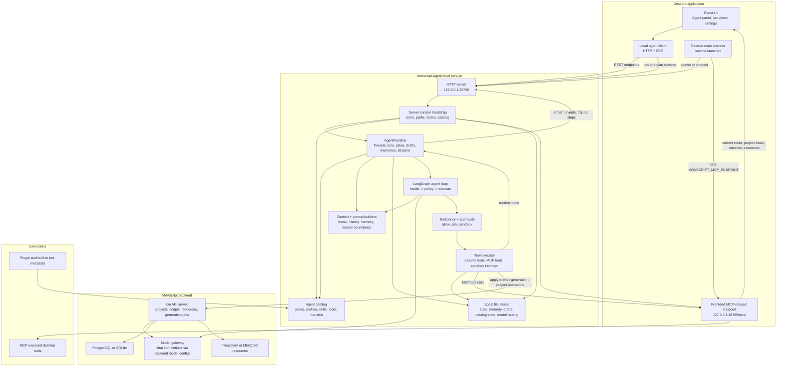
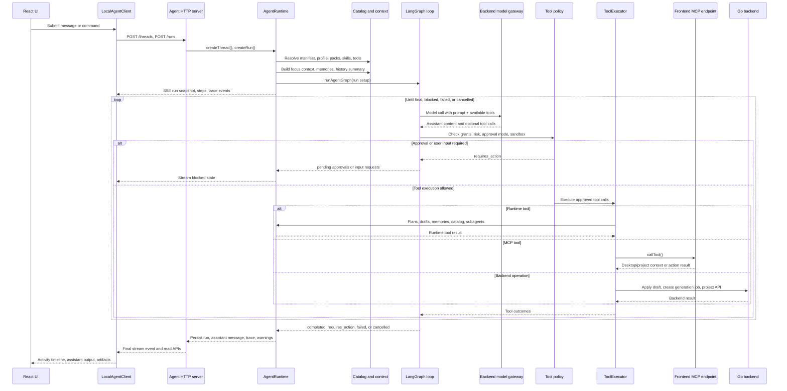

# Movscript

[简体中文](README.zh-CN.md)

Movscript is an open-source desktop production workspace for short drama and AI-assisted video creation. It combines story planning, production assets, production and scene breakdowns, storyboards, shots, canvas workflows, generation jobs, model administration, plugins, and a local agent in one local-first application.

> The project is still early. APIs, plugin manifests, and agent contracts may change before a stable release.

## What You Can Build With It

- Organize short-drama projects with scripts, assets, productions, scenes, storyboards, and shots.
- Attach media resources to project entities and store files through MinIO/S3-compatible object storage.
- Configure AI credentials, model capabilities, feature routing, credit pricing, and debug calls from the admin UI.
- Run text, image, image-edit, video, image-to-video, and video-to-video generation jobs asynchronously.
- Compose reusable canvas workflows with manual media nodes, AI nodes, tool nodes, approvals, and plugin-provided nodes.
- Extend the desktop experience with local plugins and a standalone local agent.

## Repository Layout

```text
movscript/
├── apps/backend/          Go API server, database models, AI adapters, job worker
├── apps/frontend/         Electron + Vite + React desktop application
├── apps/agent/            Local agent HTTP service and experiments
├── apps/movcli/           CLI for plugin scaffolding and packaging
├── packages/plugin-sdk/   TypeScript plugin SDK
├── packages/tokens/       Shared design tokens
├── packages/ui/           Shared React UI primitives
├── plugins/               First-party plugin examples
├── docs/                  Public documentation index
├── memory/                Maintainer notes and design-history records
└── docker-compose.yml     Local PostgreSQL, MinIO, and backend stack
```

## Current Agent Architecture

The local agent is a separate Node service managed by the desktop app in normal local use. The Electron main process can spawn the `movscript-agent` runtime, the React UI talks to it over HTTP, and the agent reads live MovScript context through the desktop MCP-shaped endpoint. Backend writes and model calls remain behind the MovScript backend, so provider credentials and formal project state do not move into the agent process.



The main agent modules are intentionally split by ownership:

| Area | Primary files | Owns |
| --- | --- | --- |
| Desktop launch | `apps/frontend/electron/agentRuntime.ts` | Starts or connects to the local runtime, validates runtime capabilities, passes MCP and backend base URLs. |
| Frontend client | `apps/frontend/src/lib/localAgentClient.ts`, `apps/frontend/src/store/agentStore.ts` | HTTP/SSE contracts, UI-facing run/thread types, user settings, local panel state. |
| HTTP boundary | `apps/agent/src/server.ts` | Local REST endpoints, run/plan SSE streams, request parsing, response serialization. |
| Runtime bootstrap | `apps/agent/src/bootstrap/agentServerContext.ts` | Environment resolution, state paths, file stores, MCP client, catalog loading, model config store, update state. |
| Application facade | `apps/agent/src/application/agentRuntime.ts` | Thread/run/plan lifecycle, draft and memory APIs, stream replay, catalog refresh, subagent orchestration entrypoints. |
| Orchestration loop | `apps/agent/src/orchestration/agentGraph.ts` | LangGraph state machine for model turns, policy checks, tool execution, finalization, cancellation, and trace events. |
| Tool execution | `apps/agent/src/orchestration/toolExecutor.ts`, `apps/agent/src/tools/` | Runtime tools, MCP calls, sandbox interception, approval risk metadata, tool grants, capability resolution. |
| Context and prompts | `apps/agent/src/orchestration/contextBuilder.ts`, `apps/agent/src/context/`, `apps/agent/src/contextManager/` | Prompt layers, focus context, history compaction, source boundaries, retrieved context, prompt budgeting. |
| Catalog | `apps/agent/catalog/`, `apps/agent/src/catalog/`, `apps/agent/src/skills/`, `apps/agent/src/profiles/` | Built-in and local packs, profiles, skills, tools, manifests, layering, linting, and reload behavior. |
| Local persistence | `apps/agent/src/state/`, `apps/agent/src/memory/`, `apps/agent/src/drafts/`, `apps/agent/src/model/` | File-backed run/thread state, memories, draft artifacts, model routing config, local runtime metadata. |

At run time, a user request becomes a persisted run and then enters the model-policy-tool loop. The graph may finish with an assistant message, pause for approval or user input, fail, or be cancelled. All meaningful transitions are recorded as run steps, trace events, and stream events so the UI can reconstruct the activity view.



Key runtime boundaries:

- The agent process owns local run lifecycle, prompt assembly, tool policy, draft state, memory state, and traceability.
- The desktop app owns the active user interface context and exposes it through the MCP-shaped local endpoint.
- The backend remains the source of truth for persisted MovScript project data, generation jobs, model configurations, credentials, and resource storage.
- Catalog files define what the agent can discover; active profiles, skills, tool grants, policies, and runtime context determine what a specific run can use.
- Sandbox mode intercepts write, generation, and destructive tools so a run can preview behavior without committing side effects.

## Quick Start

### Requirements

- Go 1.25+
- Node.js 20+
- pnpm 10+
- Docker and Docker Compose

### 1. Install Node Dependencies

```bash
pnpm install
```

### 2. Start Local Infrastructure

For the local desktop experience, you can skip Docker. Frontend-managed local mode starts the bundled backend and uses SQLite plus local filesystem storage.

Start infrastructure only when you want a separately managed backend, PostgreSQL, or MinIO:

```bash
docker compose up -d db minio createbuckets
```

This starts PostgreSQL on `localhost:5432`, MinIO on `localhost:9000`, and the MinIO console on `localhost:9001`.
Frontend-managed local mode uses SQLite on `localhost:8766` and can run alongside a separately started backend on `localhost:8765`.

### 3. Configure the Backend

```bash
cp apps/backend/.env.example apps/backend/.env
openssl rand -hex 32
openssl rand -hex 32
```

Paste the generated 64-character values into `ENCRYPTION_KEY` and `AUTH_TOKEN_SECRET` in `apps/backend/.env`.

### 4. Run the Backend and Frontend

For the local desktop experience, prefer one command:

```bash
make dev-frontend-local
```

This builds the backend and admin UI, then lets Electron host the local backend at `http://localhost:8766`. On first launch, choose Local Launch, create the local admin user, then open the admin console to configure provider credentials and models:

```text
http://localhost:8766/admin
```

If you are developing against an external backend, use the two-terminal flow:

```bash
pnpm --filter movscript-backend dev
```

In another terminal:

```bash
cp apps/frontend/.env.example apps/frontend/.env
pnpm --filter movscript-frontend dev
```

Backend health check:

```bash
curl http://localhost:8765/health
```

## Common Commands

```bash
pnpm --filter movscript-backend dev          # Go API server
pnpm --filter movscript-frontend dev         # Electron desktop app
make dev-frontend-local   # Local desktop startup with hosted backend, SQLite, and admin UI
pnpm --filter movscript-agent dev            # Local agent
pnpm run test             # Root workspace test gate
pnpm run build            # Backend, packages, apps, and plugins
pnpm run typecheck        # TypeScript typechecks where available
```

## Documentation

Start with the consolidated documentation index: [docs/README.md](docs/README.md).

Chinese entry point: [README.zh-CN.md](README.zh-CN.md).

## Open Source

Movscript is released under the [Apache License 2.0](LICENSE). Before contributing, read [CONTRIBUTING.md](CONTRIBUTING.md), [SECURITY.md](SECURITY.md), and [CODE_OF_CONDUCT.md](CODE_OF_CONDUCT.md).
