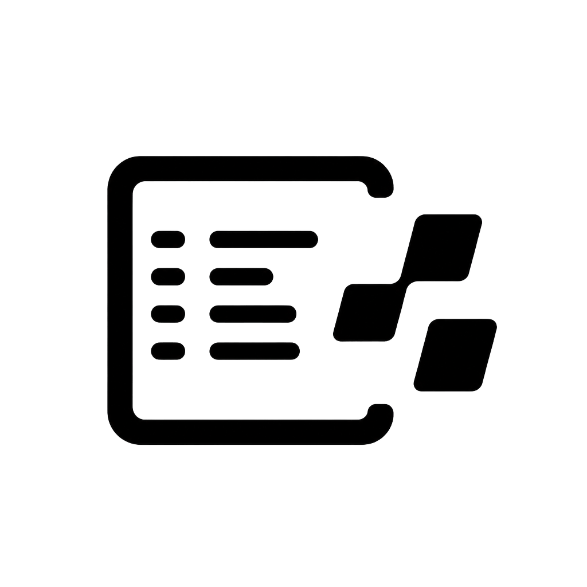

<p align="center">
  
</p>

<h1 align="center">Movscript</h1>

<p align="center">
  Video creation for Vibe Motion, AI-planned production, and automatic editing.
</p>

<p align="center">
  <a href="README.zh-CN.md">简体中文</a> | English
</p>

<p align="center">
  <a href="#overview">Overview</a> |
  <a href="#downloads">Downloads</a> |
  <a href="#docker">Docker</a>
</p>

<p align="center">
  
</p>

## Overview

Movscript helps creators turn scripts, references, and creative direction into a plannable, editable, previewable video workflow. It is built around describing the intent, feeling, rhythm, and structure of motion instead of starting from timelines and keyframes.

The community edition currently focuses on desktop video creation workflows: project planning, scripts, assets, storyboards, shots, generation jobs, model configuration, assistant workflows, and rough-cut assembly.

Movscript is still early. Features, file formats, plugin behavior, and workflows may change before a stable release.

## Downloads

### Desktop App

Current release target:

- macOS Apple Silicon / arm64
- macOS Intel / x64
- Windows x64

Download the latest desktop package from [GitHub Releases](https://github.com/movscript/movscript/releases/latest).

On macOS, install from the command line. The installer picks the Apple Silicon or Intel DMG based on your machine:

```bash
curl -fsSL https://movscript.github.io/movscript/install.sh | sh
```

On Windows, download the latest x64 `.exe` installer from [GitHub Releases](https://github.com/movscript/movscript/releases/latest).

All release notes, known issues, checksums, and previous versions are listed on the [Movscript releases page](https://github.com/movscript/movscript/releases).

Linux desktop packages are not published yet. They will be added in later releases.

## Docker

The Docker setup runs the backend service stack for integration and deployment testing. It is not a replacement for the desktop app.

Included services:

- Backend API
- PostgreSQL
- MinIO
- Redis
- Gitea
- Optional Prometheus and Grafana observability stack

### Start Services

```bash
docker compose up -d --build
```

Default local endpoints:

| Service | URL |
| --- | --- |
| Backend API | `http://localhost:8765` |
| MinIO Console | `http://localhost:9001` |
| Gitea | `http://localhost:3003` |

### Start Observability

```bash
docker compose --profile observability up -d --build
```

Default observability endpoints:

| Service | URL |
| --- | --- |
| Grafana | `http://localhost:3002` |
| Prometheus | `http://localhost:9091` |

### Stop Services

```bash
docker compose down
```

Remove local Docker volumes as well:

```bash
docker compose down -v
```

## License

Movscript is licensed under the [Apache License 2.0](LICENSE).
