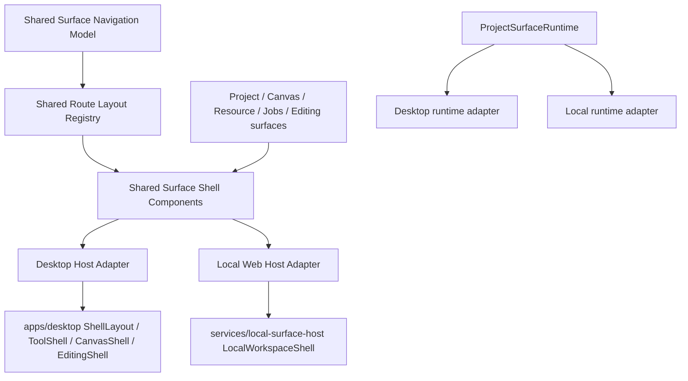
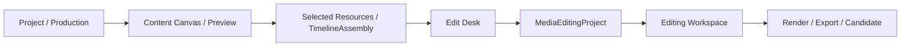

# Local Surface Host 与 Desktop UI 统一重构设计

状态：重构设计与首批落地  
日期：2026-06-29  
范围：`services/local-surface-host`、`apps/desktop`、`packages/ui`、`packages/shared`、`surface/*`

## 当前落地基线（2026-06-29）

本轮已开始按“Desktop 视觉冻结、Local 向 Desktop 心智收敛”的方向落地，已完成第一批低风险结构改造：

- `@movscript/shared` 新增 `surfaceRouteLayout` 公共入口，集中声明四个主心智、route identity、Desktop/Local path alias、area、scroll mode、shell layout 和 content width。
- Desktop 仅新增 shared route identity 读取入口，用于 contract extraction 和测试保护；现有 `RouteLayoutSpec`、视觉 surface、窗口 chrome、sidebar、header 和 pane 行为不变。
- Local route frame 已从 shared route contract 推导 frame variant；`services/local-surface-host/src/routes/localSurfaceRouteFrame.ts` 负责 shared route -> frame variant/content width 映射并尊重 shared `contentWidth`，`LocalSurfaceHostRoutes.tsx` 不再维护这部分 layout 事实源。
- Local route wrappers 已删除 `frame` override，`/editing/:editingProjectId`、agent detail 等 standalone/agent route 的 flush 决策由 shared `shellLayout` 提供；`/canvases/:id` 也已纳入 `LocalSurfaceRouteFrame`，不再直接绕过 shared layout contract。
- Local route frame 已加入共享 `@movscript/ui/business/app` 的 `AppErrorFallback` 边界；单个 surface 渲染异常会显示可重试的 route fallback，不再把整个 root 渲染为空白。
- Local 顶部主导航已改为由 shared primary nav items 生成，主心智固定为“项目、工作流画布、工具、剪辑”；Home 作为品牌入口保留，不再混入主导航。
- `@movscript/ui/layout` 新增 `AppPrimaryNav`、`AppPrimaryNavItem` 和 `AppPrimaryNavItemContent`，Local 顶部主导航已使用 shared UI primitive，`services/local-surface-host/src/styles.css` 不再维护 primary tab 视觉事实源。
- Local 工具首页侧栏已迁移到 `@movscript/ui/layout` 的 `AppSidebarShell`、`AppSidebarNav`、`AppSidebarSection` 和 `AppSidebarNavItemFrame`，不再自绘 `surface-host-tool-sidebar__entry-frame` active/item 样式。
- Local header 的 Admin、theme、language actions 已迁移到 `@movscript/ui/primitives` 的 shared `Button`，`styles.css` 已删除未引用的 `local-surface-sidebar*`、`local-surface-tab*`、`local-surface-admin-button`、`local-surface-preference-button` 等旧 shell 视觉事实源。
- Canvas editor chrome 已归一化缺失标题，`/canvases/:id` 直达 URL 在 demo/mock canvas 数据未带 `canvasName` 时不再因 `.trim()` 崩溃。
- Local agent resource detail 已对缺失/非字符串 URL 做兜底，`/agent/resources/:id` 在资源 URL 不可用时显示明确状态，而不是在 preview 中抛出异常。
- 新增 contract/boundary 测试，保护 Desktop/Local 都从 package 公共入口消费 route/layout/navigation contract，且 Local 不直接导入 Desktop 私有实现；Desktop route layout registry 也已增加 no-op 兼容测试，确保 shared contract 的 route identity/scroll/shell layout 不改变当前 Desktop 视觉基线。
- `@movscript/project-surface/runtime` 新增 `createHostedProjectSurfaceRuntime`、`projectSurfaceContextCommandEnvelope` 和 `unwrapProjectSurfaceGatewayResult`，Desktop/Local 的 Project runtime adapter 已改为提供 host capabilities、href/open、notifier 和 gateways，基础 runtime 组装、context command envelope 与 result unwrap 由 project surface 共享入口负责。
- Project Content Canvas read-model 入口已补上 workspace indexed entity 归一化，避免 Local 通过 project surface 源码消费时出现宿主间类型漂移。

当前验证状态：

- `pnpm --filter @movscript/shared test`：64 pass。
- `pnpm --filter @movscript/project-surface test`：18 pass。
- `pnpm --filter @movscript/project-surface typecheck`：pass。
- `pnpm --filter @movscript/local-surface-host typecheck`：pass。
- `pnpm --filter @movscript/local-surface-host build`：此前 header action 收敛后 pass；本轮 route frame helper / override removal 后复跑进入 `vite build` 后长时间无输出，已手动 SIGINT 中断，最新 slice 不计为 build pass。
- `pnpm --filter @movscript/desktop typecheck`：pass。
- `pnpm --filter @movscript/canvas-surface typecheck`：pass。
- Browser QA：`http://127.0.0.1:5173/tools` 在 1280x720 与 390x844 视口均非空、无 Vite overlay、console 无 error/warn；工具侧栏使用 shared `app-sidebar` class，点击 `/tools/ref-image-gen` 后 URL 和 active item 均正确。
- Browser QA：Local header actions 在 1280x720 下均渲染为 shared `.ms-button`，旧 `local-surface-admin-button` / `local-surface-preference-button` class 计数为 0；theme button 可从 light 切到 dark 并恢复；390x844 下 action label 隐藏、无横向溢出。
- Browser QA：Local route frame 在 `/projects`、`/jobs`、390x844 `/jobs` 均非空、无 Vite overlay、console 无 error/warn、无横向溢出；`/projects` 使用 `local-surface-route-frame--content` + `xwide` inner，`/jobs` 使用 `local-surface-route-frame--tool` + `full` inner。
- Browser QA：`/editing/demo-edit` 与 390x844 `/editing/demo-edit` 均由 shared `shellLayout: 'flush'` 渲染为 `local-surface-route-frame--flush`，无 Vite overlay、console 无 error/warn、无横向溢出。
- Browser QA：`/canvases/demo-canvas`、`/agent/resources/42`、`/editing/demo-edit` 在 1280x720 下均由 shared `shellLayout: 'flush'` 渲染为 `local-surface-route-frame--flush`，无 Vite overlay、console 无 error/warn、无横向溢出；`/canvases/demo-canvas` 已恢复非空 Canvas editor，`/agent/resources/42` 在缺失 URL 时显示 `Resource URL is unavailable.` 状态。
- Browser QA：`/canvases/demo-canvas` 和 `/agent/resources/42` 在 390x844 下均非空、无 Vite overlay、console 无 error/warn、无横向溢出。
- Browser QA 调试结论：此前 `/canvases/demo-canvas` 和 `/agent/resources/42` 的 blank root 分别由 Canvas title `.trim()` 空值和 resource URL `.startsWith()` 空值触发；route error boundary 让异常可见，随后已在 surface/adapter 层修复。

尚未完成的部分仍按后续 Phase 推进：共享 shell/header/sidebar primitives、Project runtime gateway adapter 继续收口、Local shell CSS 收敛、视觉截图基线与 QA。

## 背景

当前 `local-surface-host` 和 Desktop 已经复用了一部分业务 surface，例如 Project、Resource、Jobs、Shot Library、Canvas、Editing 等，但两个宿主的 UI 心智仍然明显割裂。

从代码现状看，割裂不是单纯的样式差异，而是三层结构各自演进造成的：

1. 宿主 chrome 不一致。`services/local-surface-host/src/shell/LocalSurfaceAppChrome.tsx` 使用顶栏 primary tabs；Desktop 使用 `WorkspaceShell`、`Header`、sidebar、pane registry 和窗口级 header。
2. 路由布局事实源不一致。Desktop 有 `apps/desktop/src/routes/routeLayoutRegistry.ts`，能描述 surface、scroll mode、shell layout、panes、project entry；Local 只有 `LocalSurfaceHostRoutes.tsx` 里的 route wrapper 和 `LocalSurfaceRouteFrame`。
3. 用户心智没有收敛。Desktop 中 Canvas、Editing、Tools 有独立 shell route；Local 中则以“App / Tool / Project / Edit / Canvas”顶栏并列呈现，导致用户无法建立同一套空间模型。

已有基础值得保留：

- `packages/ui` 已有 `WorkspaceShell`、`AppRouteViewport`、`AppContentLayout`、`SurfaceRouteFrame`、pane resize primitives 和 app/window chrome primitives。
- `packages/theme`、`packages/tokens` 已提供 `--ms-*` 设计变量和 light/dark theme。
- Project surface 已有宿主无关的 `ProjectSurfaceProvider`、`ProjectSurfaceRuntime`、`PROJECT_SURFACE_ROUTES` 和 route view。
- Desktop 的 `routeLayoutRegistry` 已经是可抽象成跨宿主 layout contract 的雏形。

核心目标：让 Web Local Surface 向当前 Desktop 的产品视觉和工作区架构收敛，而不是重新设计 Desktop。Desktop 现有视觉在本轮作为基准和保护对象；重构只允许抽取 Desktop 已有的 layout contract、导航语义和 shared primitives，不应改变 Desktop 用户看到的外观、密度、窗口 chrome、sidebar、header 或 pane 行为。

## 设计原则

1. 用户心智先于代码路径。导航和页面分组按用户任务组织：项目、工作流画布、工具、剪辑，而不是按 package、service 或 window 类型组织。
2. Layout contract 先于宿主实现。每个 route 先声明它是什么 surface、需要什么 chrome、pane、scroll、content width，再由 Desktop 或 Local 选择如何渲染窗口控制和浏览器控制。
3. 业务 surface 不拥有宿主 chrome。Project、Canvas、Tool、Editing 页面只声明所需 header slots、pane slots、actions 和 runtime capabilities，不直接决定顶栏、左栏或窗口外壳。
4. 视觉 token 单源。颜色、半径、字体、边框、阴影、间距使用 `@movscript/tokens` 和 `@movscript/ui`，Local 不再维护一套高饱和绿色/蓝色渐变和自定义 shell。
5. 工作区优先，营销感后退。首页可以有导览，但核心页面应是密度适中、可扫描、可重复操作的工具界面。
6. Agent 是横切能力，不是额外主心智。Agent/HeyGen/插件能力可以出现在工具、项目助手或候选生成流里，但不应强迫用户理解另一套导航层级。
7. Desktop 视觉冻结。Desktop 的当前 UI 不作为视觉重做对象；任何 Desktop 侧代码改动都必须是无视觉差异的 contract extraction、类型迁移、测试补强或兼容适配。

## 目标用户心智

| 用户心智 | 用户问题 | 代表 surface | 导航定位 |
| --- | --- | --- | --- |
| 项目 | 我正在做哪个片子/项目？项目资产、标准、脚本、进度在哪里？ | Project Overview、Standards、Scripts、Settings、Resources | 主工作区 |
| 工作流画布 | 我要把生产任务、内容单元、候选、依赖组织成可执行流程 | Content Canvas、Content Preview、Canvas Editor | 项目内主工作区或独立画布工作区 |
| 工具 | 我要快速生成/处理图片、视频、音频、文本、素材 | Image/Video/Audio/Text Tools、Shot Library、Jobs、Resource Library、插件工具、HeyGen 类视频工具 | 工具工作区 |
| 剪辑 | 我要把选中的素材变成可播放时间线和最终成片 | Editing List、Editing Workspace、Edit Desk handoff | 剪辑工作区 |

这四个心智在 Desktop 和 Local 中应一致。差异只允许来自宿主能力：

- Desktop 有原生窗口控制、dock shortcut、Electron file picker、terminal dock、macOS traffic lights。
- Local 有浏览器 URL、浏览器返回/前进、主题/语言偏好、服务端 endpoint 状态。

这些差异应由 host adapter 渲染，而不是改写业务 IA。视觉对齐方向是 Local 复用 Desktop 已验证的 shell、header、sidebar、pane 和 route layout 语义；Desktop 不为了照顾 Local 而改变外观。

## 目标架构



目标分层：

| 层 | 责任 | 建议落点 |
| --- | --- | --- |
| Surface navigation model | 定义用户心智、主导航、二级导航、route identity、icon、label key | 当前落点 `packages/shared/src/surfaceRouteLayout.ts`；后续可按复杂度拆分 |
| Route layout registry | 定义 route 的 surface、chrome、scroll、pane、content width、project entry | 当前落点 `packages/shared/src/surfaceRouteLayout.ts`；Desktop/Local 只保留 path adapter |
| Shell components | 渲染 `WorkspaceShell`、header slots、left/right/bottom panes、route viewport | `packages/ui/src/components/layout` |
| Host adapter | Desktop/Local 专属窗口控制、浏览器控制、endpoint 状态、偏好入口 | `apps/desktop/src/features/app-shell`、`services/local-surface-host/src/shell` |
| Business surface | 只声明内容、状态、动作和 runtime contract | `surface/project`、`surface/canvas`、`surface/editing`、`surface/resource`、`surface/jobs` |

## 统一 Layout Contract

当前 `RouteLayoutSpec` 已经接近目标，但需要从 Desktop 局部类型升级成跨宿主合同。

建议目标字段：

```ts
type SurfaceArea = 'home' | 'project' | 'workflow' | 'tool' | 'editing' | 'agent' | 'settings'
type SurfaceChrome = 'workspace' | 'immersive' | 'canvas' | 'document'
type SurfaceHost = 'desktop' | 'local-web'

interface SharedSurfaceRouteSpec {
  routeId: string
  area: SurfaceArea
  pathPattern: string
  chrome: SurfaceChrome
  scrollMode: 'document' | 'workspace' | 'canvas' | 'hidden'
  shellLayout: 'stacked' | 'flush'
  contentWidth?: 'narrow' | 'normal' | 'wide' | 'xwide' | 'full'
  panes: RouteLayoutPaneSpec[]
  primaryNavKey?: 'project' | 'workflow' | 'tool' | 'editing'
  secondaryNavKey?: string
  projectEntryId?: string
  capabilityHints?: string[]
  hostOverrides?: Partial<Record<SurfaceHost, Partial<SharedSurfaceRouteSpec>>>
}
```

关键变化：

- `surface: 'canvas'` 不应直接等于用户心智。独立 Canvas 和 Project Content Canvas 都属于“工作流画布”，但 chrome 可以是 `canvas`。
- `editing` 应成为一等 area，而不是落在 Desktop 的 `surface: 'tool'` 下。
- `agent` 只作为 agent browser surfaces 或 project assistant pane 的 area，不进入主导航四象限。
- `projectEntryId` 应保持业务含义，例如 `content_canvas`、`content_preview`、`orchestration_production`，不要绑定 Desktop route。

## 统一导航结构

主导航统一为四个入口：

1. 项目
2. 工作流画布
3. 工具
4. 剪辑

Desktop 表现：

- 保持当前视觉和交互表现。
- 大窗口继续使用现有 `WorkspaceShell` 左侧栏或项目 header 内的 entry deck。
- 独立窗口继续保留 Canvas/Editing 当前窗口形态；仅把 header、返回路径、标题、状态区背后的语义抽成同一 contract。
- Project pages 继续保留右侧 Project Agent pane；它是辅助面板，不改变主导航。

Local 表现：

- 大窗口：不再使用 `LocalSurfaceAppChrome` 的横向 primary tabs 作为主 IA；改用与当前 Desktop 同源的 sidebar/rail + header 结构。
- 窄屏：主导航折叠为顶部横向 rail 或底部 navigation rail，但 item 顺序和 label 与 Desktop 一致。
- `/studio/:projectId/*` 保持浏览器 URL 可分享，但 route identity 与 Desktop 的 `/project/*` 兼容 route 统一。

推荐 route identity 映射：

| Route identity | Desktop path | Local path | Area |
| --- | --- | --- | --- |
| `project.overview` | `/project/home`、`/studio/:projectId/overview` | `/studio/:projectId/overview` | project |
| `project.content.canvas` | `/project/content/canvas`、`/studio/:projectId/content/canvas` | `/studio/:projectId/content/canvas` | workflow |
| `project.content.preview` | `/project/content/preview`、`/studio/:projectId/content/preview` | `/studio/:projectId/content/preview` | workflow |
| `studio.editDesk` | `/studio/:projectId/edit-desk` | `/studio/:projectId/edit-desk` | editing |
| `tools.image` | `/tools/image` | `/tools/image` 或兼容 `/tools/ref-image-gen` | tool |
| `resources` | `/resources` | `/resources` | tool |
| `jobs` | `/jobs` | `/jobs` | tool |
| `canvases` | `/canvases` | `/canvases` | workflow |
| `canvas.editor` | `/canvases/:id` | `/canvases/:id` | workflow |
| `editing` | `/editing` | `/editing` | editing |
| `editing.project` | `/editing/:editingProjectId` | `/editing/:editingProjectId` | editing |

## 视觉规范

### Shell

所有 workspace 级页面使用同一几何：

- 根容器：`WorkspaceShell`
- 内容视口：`AppRouteViewport`
- 文档型页面：`AppContentLayout` 或 `SurfaceRouteFrame`
- Canvas/Timeline 型页面：`viewportScroll="owned"`，由 surface 自己管理滚动、缩放、拖拽
- Pane：使用 `RouteLayoutPaneSpec` 描述尺寸、折叠、持久化、overlap mode

Desktop 当前视觉为验收基线。Local 不再维护以下 shell 级样式作为长期事实源：

- `.local-surface-shell`
- `.local-surface-topbar`
- `.local-surface-primary-tabs`
- `.surface-host-tool-sidebar`
- `.surface-host-tool-shell`

这些样式可在迁移期保留兼容，但目标是由共享 shell 替代。替代方向不是创造新的第三套视觉，而是让 Local 使用 Desktop 现有 shell primitives 的浏览器宿主版本。

### 色彩与密度

统一使用 `--ms-color-*`、`--ms-radius-*`、`--ms-text-*`。

约束：

- 页面背景不再使用 Local 当前的大面积青绿/蓝色渐变。
- 顶层工作区使用中性背景和清晰边界；accent 只用于选中态、主操作、状态提示。
- Card radius 默认不超过 `8px`，除非已有 shared primitive 明确需要更大 overlay/window radius。
- 工具/项目/剪辑页面避免 hero 化。首页可有导览，但第一屏仍应优先展示最近项目、常用入口和当前工作状态。
- 图标按钮优先使用 `AppWindowIconButton`、`Button size="icon-*"` 和 lucide 图标，文本按钮只用于明确命令。

### Header Slots

统一 header slot：

| Slot | 内容 |
| --- | --- |
| navigation | Home、Back、Forward、project/workspace breadcrumb |
| layout | sidebar toggle、pane toggle、view mode |
| center | route title、inline title editor、project/production context |
| primary actions | run、save、generate、export、render |
| context actions | resources、jobs、assistant、terminal |
| global actions | settings、theme/language、account、update |

Desktop 的 `Header` 已有这些 slot。Local 应提供同形状的 `LocalHeaderAdapter`，差异只在是否显示 native window controls。

## 工作流画布规范

工作流画布属于数据可视化/图结构工作区，不应被当作普通卡片页。

要求：

- 主要证据始终可见：节点名称、类型、状态、依赖方向、候选/selection 状态不能只靠 hover。
- 移动端用 tap/focus 替代 hover，节点详情进入可关闭 inspector。
- URL 或 local/session state 记录选中节点、zoom、pan、active production/content unit。
- Canvas、Content Canvas、Preview Timeline 的 side panes 使用同一 pane contract，避免每个 surface 自己决定尺寸和折叠行为。
- 视觉编码要有含义：颜色区分状态、类型或风险；不要用装饰性渐变、光效或无信息背景纹理表示流程。
- `content_canvas`、`content_preview`、`setting_preview` 共享同一布局骨架，只切换左侧结构、中心画布/预览、右侧 inspector 的内容职责。

## 工具与插件心智

Tools 不应是一个杂物抽屉，而应按能力分组：

- 生成：图片、视频、音频、文本
- 素材：Resources、External Resources、Private Assets、Shot Library
- 任务：Jobs、History、Generation runs
- 插件：provider/plugin tools，例如 HeyGen 类 avatar/video 工具

HeyGen 这类能力不需要新建顶层导航。它应作为 Tool provider surface 或 generation workflow 的 provider-backed action 出现：

- “创建 avatar / 生成 presenter video” 属于视频/头像工具组。
- 若某个 project content unit 使用 HeyGen 生成结果，结果仍进入 RawResource/Candidate/Selection 流程。
- 插件工具页面使用同一 Tool shell、同一 resource pane、同一 job/status feedback。

## Project 与 Editing 的关系

`Edit Desk` 是项目内的剪辑交接台，`Editing Workspace` 是真实剪辑工作区。

目标关系：



UI 上：

- Project 中的 `Edit Desk` 仍在项目主工作区内，用于检查 production、素材覆盖、handoff readiness。
- `/editing` 和 `/editing/:id` 是剪辑工作区，适合全屏 timeline 和 media controls。
- Desktop 和 Local 都应把“剪辑”作为主心智，而不是 Desktop 里归 tool、Local 里单独顶栏 tab。

## 重构路线

### Phase 0：Desktop 视觉基线和命名冻结

输出：

- Desktop 视觉保护基线：Desktop 选 8 个 route，记录第一屏、窄屏、关键交互态，作为“不改 Desktop 视觉”的回归基线。
- Local 对照基线：Local 选同 route identity 的页面，记录差异，用于后续向 Desktop 收敛。
- Route inventory：列出所有 route 的 current owner、runtime adapter、scroll owner、pane owner。
- 冻结四个主心智 label：项目、工作流画布、工具、剪辑。

建议基线路由：

- `/`
- `/projects`
- `/studio/:projectId/overview`
- `/studio/:projectId/content/canvas`
- `/studio/:projectId/edit-desk`
- `/tools/image` 或 `/tools/ref-image-gen`
- `/resources`
- `/editing/:editingProjectId`

### Phase 1：抽共享 Route Layout Registry

目标：

- 从 Desktop `routeLayoutRegistry.ts` 提取宿主无关 route specs。
- Local 和 Desktop 都通过同一 `routeLayoutSpecForPathname` 或 `routeIdentityForPathname` 获得 layout。
- 保留 host-specific path matcher，避免强迫 Desktop 和 Local 立刻统一 URL。

建议文件：

```text
packages/shared/src/surfaceRouteLayout.ts
packages/shared/tests/surface-route-layout.test.mjs
```

Desktop 迁移：

- `apps/desktop/src/routes/routeLayoutRegistry.ts` 改为组装 shared specs + Desktop path aliases。
- Desktop 迁移必须以 visual no-op 为门槛：DOM class、header slot、pane 尺寸、默认折叠状态和可见文案不应改变，除非另有明确产品决策。

Local 迁移：

- `services/local-surface-host/src/routes/LocalSurfaceHostRoutes.tsx` 不再手写 `LocalModeSurfaceRoute` / `LocalToolSurfaceRoute` frame 分支，而是读取 shared route spec。

### Phase 2：引入跨宿主 Surface Host Shell

目标：

- 在 `packages/ui` 增加宿主无关 `SurfaceHostShell` 或扩展 `WorkspaceShell` adapter contract。
- Desktop `ShellLayout`、`ToolShellRoute`、`CanvasListShellRoute`、`EditingShellRoutes` 和 Local `LocalSurfaceAppChrome` 逐步改成同一 shell primitive。

建议接口：

```ts
interface SurfaceHostChromeAdapter {
  renderHeader(input: SurfaceHeaderSlots): ReactNode
  renderGlobalActions(input: SurfaceGlobalActions): ReactNode
  renderNavigation(input: SurfaceNavigationModel): ReactNode
}
```

Desktop adapter 提供 native window controls。Local adapter 提供 browser back/forward、theme/language、endpoint status。

这一阶段的 Desktop 侧目标是抽象，不是重画。任何能在 Local 完成的视觉对齐，都应优先改 Local adapter 或 shared host shell 的 Local 分支，避免牵动 Desktop 现有表现。

### Phase 3：统一主导航和二级导航

目标：

- 主导航由 `surfaceNavigation.ts` 生成，Desktop/Local 渲染不同但顺序、分组、active 逻辑一致。
- Tool sidebar 不再由 Desktop `Sidebar.tsx` 和 Local `LocalSurfaceToolFrame` 各自维护。
- Project route deck 和 Local project topbar 共享 route definitions。

验收：

- “项目、工作流画布、工具、剪辑”在两个宿主出现顺序一致。
- active route 对 `/studio/:projectId/content/canvas`、`/project/content/canvas`、`/canvases/:id` 都能映射到“工作流画布”。
- Resources、Jobs、Shot Library 在两个宿主都位于工具/素材/任务组，不漂移到其他主导航。

### Phase 4：合并 Project Runtime Adapter 重复逻辑

Desktop 和 Local 都已经通过 `createProjectSurfaceRuntime` 创建 runtime，但 endpoint、context session、decision store、notifier 分散在两套实现中。

目标：

- 抽 `createHostedProjectSurfaceRuntime`，输入 host capabilities 和 endpoint adapter。
- Local/desktop 只提供 `postProjectWorkspaceOperation`、file picker、notifier、window navigation、media pipeline capabilities。
- Project surface 不感知宿主差异。

建议落点：

```text
surface/project/src/runtime/HostedProjectSurfaceRuntime.ts
apps/desktop/src/features/app-shell/application/desktopProjectSurfaceRuntime.tsx
services/local-surface-host/src/project/localProjectSurfaceRuntime.ts
```

### Phase 5：删除 Local 专属 Shell CSS

目标：

- `services/local-surface-host/src/styles.css` 只保留 host adapter、home 特有布局和少量兼容样式。
- `.local-surface-topbar`、`.local-surface-primary-tabs`、`.surface-host-tool-sidebar` 迁移完成后删除。
- 共享视觉全部来自 `@movscript/ui/styles/surface-host.css`、`layout.css`、business styles。

### Phase 6：视觉和行为 QA

验收矩阵：

| 检查 | Desktop | Local |
| --- | --- | --- |
| Desktop 视觉无回归 | 必须 | 不适用 |
| 主导航顺序一致 | 保持现状语义 | 必须向 Desktop 收敛 |
| route active state 一致 | 保持现状语义 | 必须向 Desktop 收敛 |
| header slot 语义一致 | 抽取但不改视觉 | 必须向 Desktop 收敛 |
| pane 尺寸和折叠持久化 | 保持现状 | 必须，无法持久化时明确降级 |
| document/workspace/canvas scroll owner 正确 | 保持现状 | 必须 |
| 项目 route 可分享 | 可选 | 必须 |
| 原生窗口控制 | 保持现状 | 不适用 |
| 浏览器返回/前进 | 可用 | 必须 |
| light/dark token 一致 | 保持现状 | 必须 |
| 窄屏无溢出 | 必须 | 必须 |

## 测试计划

新增/调整测试：

1. `packages/shared/tests/surface-route-layout.test.mjs`
   - 每个 route identity 有唯一 area。
   - 每个主心智至少有一个可达 route。
   - Desktop path alias 和 Local path alias 映射到同一 route identity。

2. `apps/desktop/src/features/app-shell/application/appShellLayoutContract.test.ts`
   - 改为断言 Desktop 使用 shared route registry。
   - 保留 Canvas/Editing 独立 shell 行为断言。

3. `services/local-surface-host/src/routes/localSurfaceHostLayoutContract.test.tsx`
   - 断言 Local route 不再绕过 shared layout spec。
   - 断言 `/studio/:projectId/content/canvas` 使用 workflow/canvas scroll。

4. Visual regression
   - Desktop + Local 同 route identity 截图对照。
   - Desktop 截图必须与 Phase 0 基线保持视觉一致。
   - 宽屏和 390px mobile portrait。
   - 检查 header、sidebar、content padding、active nav、theme。

5. Accessibility
   - 主导航可键盘访问。
   - icon-only controls 有 aria-label/title。
   - hover-only 信息在 tap/focus 下可访问。

## 风险与处理

| 风险 | 处理 |
| --- | --- |
| Desktop route 和 Local route path 不一致 | 使用 route identity 层兼容，不强行一次性改 URL |
| Local 需要浏览器可分享 URL | 保留 `/studio/:projectId/*`，只统一 layout contract |
| CSS 迁移影响大量页面 | 先引入 shared shell，再逐 route 切换，最后删旧 CSS |
| 抽 shared contract 时误改 Desktop 视觉 | Desktop Phase 0 截图作为保护基线；Desktop PR 以 visual no-op 合入 |
| Canvas/Editing 独立窗口体验被削弱 | 保留独立 shell route，但 header slots 和 navigation model 共享 |
| Agent/插件能力干扰主导航 | Agent 作为 project assistant pane 或 agent browser surface；插件工具进入 Tools |
| Pane persistence 在 Local 和 Desktop 存储不同 | contract 只定义 key 和行为，host adapter 决定 storage backend |

## 非目标

- 不在本轮重写 Project/Canvas/Editing 的业务模型。
- 不把 Desktop 原生窗口能力搬到 Local。
- 不改变 Desktop 当前视觉、密度、窗口 chrome、sidebar、header、pane 默认状态和核心交互。
- 不把 Local URL 结构强制改成 Desktop `/project/*`。
- 不把 HeyGen 或其他 provider 插件提升成一级导航。
- 不追求一次 PR 完成全部视觉迁移。

## 完成定义

当以下条件满足时，可以认为这次统一重构完成：

1. Desktop 和 Local 从同一 route identity/layout registry 获取 surface area、chrome、scroll、pane 信息。
2. Desktop 截图与 Phase 0 视觉基线无可见回归。
3. 四个主心智在两个宿主中名称、顺序、active state 一致，且 Local 向 Desktop 表现收敛。
4. Local 不再使用独立 topbar primary tabs 作为主导航。
5. Tool sidebar、Project route deck、Canvas/Editing header 至少复用同一导航模型。
6. Project surface runtime 的宿主差异被 adapter 封装，业务页面不关心 Desktop/Local。
7. `services/local-surface-host/src/styles.css` 中 shell 级自定义样式显著减少，视觉 token 来自共享 UI 包。
8. 至少 8 个核心 route 的 Desktop/Local 截图通过视觉验收：用户能一眼看出这是同一个产品、同一套工作区架构，同时 Desktop 仍是原来的 Desktop。
