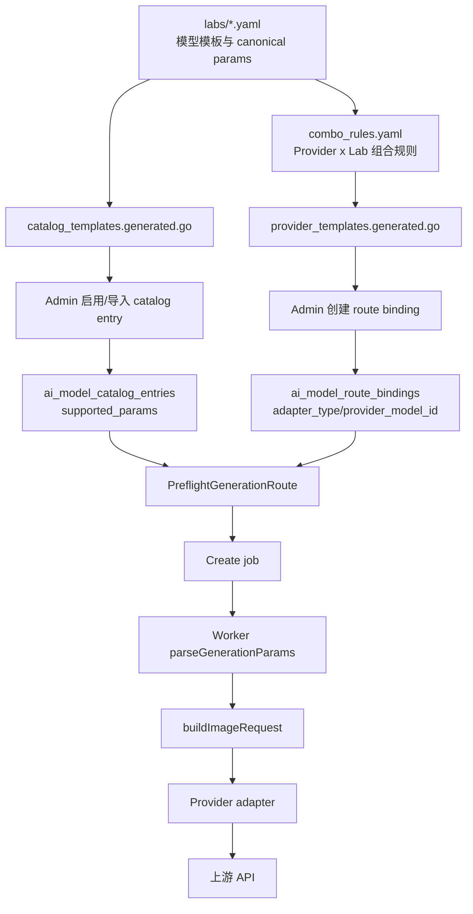

# MovScript 模型、Provider、Adapter 与参数契约整合方案

状态：规划稿
日期：2026-07-02
背景案例：火山 Ark 官方 `doubao-seedream-4-5-251128` 调用时，系统发送了模型不支持的 `output_format`，上游返回 `InvalidParameter`。

## 1. 目标

这份文档要解决的问题不是单个参数怎么修，而是把 MovScript 当前分散在 model registry、admin catalog、route binding、preflight、worker、provider adapter、前端参数编辑器里的模型能力和参数契约收口成一条一致链路。

目标状态：

- 模型支持哪些 MovScript canonical params，由模型模板和 operation profile 决定。
- Provider / AI Account 只描述调用边界：endpoint、凭据、协议族、默认 adapter。
- Route binding 决定某个 catalog model 实际走哪个 provider account、哪个 `provider_model_id`、哪个 adapter。
- Adapter 只做 canonical params 到 provider-native request body 的映射和序列化。
- Job 中保存的是 preflight 后的 sanitized params，而不是未经校验的 UI/API 原始输入。
- 不支持的参数在 MovScript 内部被拦住，不能等上游 400 才暴露。

## 2. 当前概念边界

### Lab model template

位置：`services/data-service/internal/infra/ai/model_registry/labs/*.yaml`

表示模型创造者或模型族的能力声明，例如 Seedream、OpenAI、Gemini、ElevenLabs。这里应该声明 MovScript canonical params，例如 `image_size`、`watermark`、`output_format`，不能声明 provider-native 字段映射，例如 `image_size -> size` 或 `prompt_strength -> guidance_scale`。

现有 README 已经写明：registry YAML 是 admin model catalog templates 的事实来源，并且 adapter 映射属于 adapter code。

### Provider / AI Account template

位置：`model_registry/providers.yaml`

表示调用账户或调用边界，例如官方火山 Ark、OpenAI official、relay gateway、本地 runtime。Provider template 不应该扩大模型能力，只能提供 endpoint、认证、provider kind、默认 adapter 等调用信息。

### Combo template

位置：`model_registry/combo_rules.yaml` 及 generated provider templates

Combo template 是“某类 lab model 可以用某类 provider 调用”的便捷组合。例如当前规则里 `provider_type: volcen` + `lab: seed` 会生成火山 Ark 官方的 Seed 系列组合。Combo template 可以给 route binding 提供默认 adapter 和 provider model id，但不应该覆盖模型模板的参数白名单。

### Catalog entry

位置：数据库 `ai_model_catalog_entries`

表示 MovScript 对用户暴露的公共模型。它需要保存：

- `model_template_key`
- `public_model_id`
- structured `model_capabilities_json`
- operation-scoped `supported_params`
- 输入资源限制，例如 `accepts_image`、`max_input_images`

Catalog entry 是 runtime 校验模型能力时最接近业务的持久化快照。这里的 `supported_params` 不能长期为空，否则后续 preflight 会失去模型级白名单。

### Route binding

位置：数据库 `ai_model_route_bindings`

表示某个 catalog entry 的实际调用路径。它应该持久化：

- `provider_id`
- `adapter_type`
- `provider_model_id`
- `route_group`
- `combo_template_key`

route binding 的 `adapter_type` 是最终请求协议的事实来源。不能在 runtime 再通过 provider id 或 template hint 猜 adapter。

### Adapter

位置：`services/data-service/internal/infra/ai/adapter_*.go`

Adapter 负责把 MovScript canonical request 变成上游 API body。例如 Volcen Ark 图像生成最终要发送 `size`、`guidance_scale`、`sequential_image_generation`、`output_format` 等 provider-native 字段。

Adapter 不应该决定某个具体模型支持哪些参数。它可以知道协议能表达什么，但不能把某个模型族或某个新模型的能力当成所有模型的默认能力。

## 3. 当前链路



关键代码位置：

- `PreflightGenerationRoute` 会调用 `ValidateAndNormalizeGenerationParamsForOperation`，并返回 `NormalizedParams`。
- `EnqueueGeneration` 目前创建 job 时保存的是原始 `input.ExtraParams`，不是 preflight 后的 `NormalizedParams`。
- `parseGenerationParams` 只做 alias normalize，不按模型白名单重新过滤。
- `buildImageRequest` 会把 `output_format` 等字段放进 `ai.ImageRequest`。
- `VolcenAdapter.ImageGenerate` 只要 `req.OutputFormat` 非空，就会序列化成 Ark request 的 `output_format`。

## 4. Seedream 4.5 错误说明了什么

这次请求：

```json
{
  "model": "doubao-seedream-4-5-251128",
  "output_format": "jpeg",
  "size": "2048x2048",
  "watermark": true,
  "sequential_image_generation": "disabled",
  "optimize_prompt_options": { "mode": "standard" }
}
```

火山 Ark 返回：

```text
The parameter `output_format` is not supported by the current model
```

源码模板里，`volcengine:seedream-4-5` 的 params 包含 `image_size`、`watermark`、`sequential_image_generation`、`image_count`、`optimize_prompt_mode`，不包含 `output_format`。而 Ark 原生的 `seedream-5-0` 和 `seedream-5-0-lite` 模板包含 `output_format`。

本地运行态暴露的问题是：

- `seedream-4-5` route 已经绑定到 `volcen` adapter 和 `doubao-seedream-4-5-251128`。
- `seedream-4-5` catalog entry 的 `supported_params` 为空。
- `ValidateAndNormalizeGenerationParamsForOperation` 在没有显式 supported params 时会放行现有参数。
- `volcenImageParams()` 当前从 `volcenSeedream5LiteParams()` 派生，因此 adapter 级默认参数里包含 `output_format`。
- Worker 保存和读取的是原始参数，adapter 最终把 `output_format` 发给了 4.5。

正确行为应该是四层都能拦住：

1. Admin UI 不展示 `output_format`。
2. API preflight 对显式传入的 `output_format` 报 MovScript 自己的 unsupported parameter 错误。
3. Job 中不保存未通过 preflight 的参数。
4. Adapter last-mile serialization 不发送模型白名单之外的字段。

## 5. 需要统一的参数契约模型

### 5.1 参数分层

建议把参数拆成五层，不再混用：

1. 全局参数词汇表
   只定义 canonical key、label、type、常见 options、alias。前端 `PARAM_TEMPLATES` 属于这一层。它不是模型能力来源。

2. 模型模板参数
   `labs/*.yaml` 声明某个模型支持哪些 canonical params。这里是模型能力的源码事实。

3. Operation param profile
   catalog entry 持久化 operation-scoped profile，例如 `image_generation` 和 `image_edit` 可以有不同参数。这里是 runtime 校验事实。

4. Route adapter binding
   route binding 决定最终 adapter。它不增加模型参数，只决定如何把 canonical params 映射到 provider-native fields。

5. Provider-native request body
   adapter 序列化最终请求。只有通过 operation profile 的参数才能进入 body。

### 5.2 Alias 与 native mapping 分离

Alias normalize 应该发生在 preflight 入口：

- `size -> image_size`
- `guidance_scale -> prompt_strength`
- `max_images -> image_count`
- `ratio -> aspect_ratio`

Provider-native mapping 应该只发生在 adapter：

- `image_size -> size`
- `prompt_strength -> guidance_scale`
- `image_count -> sequential_image_generation_options.max_images`

不要在 UI、job、catalog profile 中保存 provider-native 字段。否则模型能力、用户参数和上游协议会互相污染。

### 5.3 空 `supported_params` 的语义

当前空 `supported_params` 实际上会导致“非显式 profile 下放行所有参数”。这对官方模型风险很高。

已决策：不为 `supported_params` 保留向后兼容的 permissive 模式。启用模型必须有显式 operation profile，空 profile 就是配置错误。

规则：

- 任意启用的 catalog entry，只要参与 generation route，`supported_params` 必须非空且按 operation 声明。
- Data Service 启动时默认删除历史空 `supported_params` 的 generation catalog entry，不尝试静默修复，也不在 runtime 继续兼容放行。
- 启动清理应在事务内先删除关联 route binding，再删除对应 catalog entry，并记录 `public_model_id`、`model_template_key`、route 数量等诊断信息。
- 内置模板可以在清理后重新启用，重新启用时必须生成新的非空 operation profile。
- gateway / relay route 也不能因为调用面不确定就绕过模型参数契约；确实未知的模型应先进入未启用或待配置状态。
- Admin 页面、registry audit、启动诊断都应该把空 profile 视为错误。

### 5.4 默认值不能等于必须发送

UI 默认值、MovScript 默认值、provider 默认值要区分：

- UI 默认值用于表单展示。
- MovScript 默认值用于用户没有传参时的业务体验。
- Provider 默认值应该尽量让上游自己处理，除非该模型 profile 明确允许此参数。

规则：

- 用户显式传入 unsupported param：preflight hard fail。
- 系统默认值属于 unsupported param：不要发送，并记录 debug trace。
- adapter 不能因为有 adapter-level default params 就自动扩大模型 profile。

## 6. Catalog 与 combo 的整合规则

### 6.1 启用内置模板

启用 catalog entry 时，`supported_params` 应由三件事共同生成：

- 模型模板的 `params`
- structured `model_capabilities_json`
- 最终 route adapter 或 combo adapter

如果是 combo template 启用，生成 profile 时必须使用 combo 最终 adapter，而不是原始 model template 的 `route_adapter_hint`。Seedream 4.5 这类模板尤其敏感：模板 hint 可能是 `openai_compat`，但火山官方 route 实际 adapter 是 `volcen`。

### 6.2 导入 provider 模型

导入路径当前更接近正确方向：`modelImportSupportedParams` 使用 `plan.AdapterType` 生成 operation profile。启用内置 combo 和导入 provider 模型应该收敛到同一套 resolver，避免两条路径生成不同 profile。

### 6.3 建议新增 ParamContractResolver

引入一个后端内部 resolver，作为唯一入口：

```text
ResolveParamContract(template, capabilities, adapterType, operation) -> ModelOperationParamProfile
```

它负责：

- normalizing ParamDef for UI
- alias canonicalization
- 按 operation 生成 allow/deny/override
- 校验 template params 是否能被 adapter 表达
- 输出 stable JSON profile
- 对空 profile、未知 param、adapter mismatch 给 diagnostics

Admin、model import、启动清理、audit、preflight 测试都使用这一套 resolver 或同一套诊断规则。

## 7. Preflight、Job 与 Worker 的整合规则

### 7.1 Preflight 是入队前的硬门

`PreflightGenerationRoute` 已经返回 `NormalizedParams`。下一步应该让 job 创建使用这个结果：

- `RequestContext.ExtraParams` 保存原始输入和 normalized 输入，便于审计。
- `Job.ExtraParams` 保存 sanitized normalized params，供 worker 直接使用。

建议结构：

```json
{
  "raw_extra_params": {"size": "2048x2048", "output_format": "jpeg"},
  "normalized_extra_params": {"image_size": "2048x2048"},
  "dropped_defaults": ["output_format"],
  "rejected_params": []
}
```

如果 `output_format` 是用户显式传入且模型不支持，preflight 应该直接失败，不应进入 job。

### 7.2 Worker 是防御门，不是第一校验点

Worker 读取 job 后可以再次校验 route + catalog entry 的 param profile，原因是：

- job 可能来自老版本数据。
- catalog/route 可能在入队后被修改。
- 有些任务可能绕过了标准 API path。

但 worker 不应该靠 adapter 默认参数来推断模型能力。

### 7.3 Adapter 是最后一道门

Adapter 序列化前应拿到一个已经过滤过的 request，或者拿到 profile snapshot。它需要保证：

- 不序列化 profile 外参数。
- provider debug body 标明哪些参数被发送。
- 对无法表达但 profile 允许的参数报内部错误。

这能避免因为某个 runner 字段非空就把不属于该模型的参数发到上游。

## 8. Admin UI 的整合规则

前端 `PARAM_TEMPLATES` 只适合作为编辑体验和 label/type 的辅助词典。它不应该决定某个模型支持哪些参数。

Admin UI 应该消费后端返回的 operation profile：

- 模型详情页展示当前 operation 支持参数。
- route binding 页展示最终 adapter 和 provider model id。
- 如果 profile 为空但模型启用，显示配置诊断。
- 如果用户添加 custom param，后端用同一套 ParamContractResolver 校验。

UI alias 归一化仍然有价值，但归一化后的结果必须回到 canonical contract，而不是直接写 provider-native 字段。

## 9. 改造路线

### P0：阻断当前错误

- 启动时删除历史空 `supported_params` 的 generation catalog entry 及其 route binding。
- 重新启用 Seedream 4.5 时生成非空 `supported_params`，且不包含 `output_format`。
- 修正 combo enable 路径，使用最终 combo adapter 生成 `supported_params`。
- Job 创建时保存 `preflight.NormalizedParams`。
- 为 `seedream-4-5 + volcen` 加 adapter/request 测试，断言请求体不包含 `output_format`。

### P1：统一参数契约

- 新增 `ParamContractResolver`。
- `EnableComboTemplate`、`modelImportSupportedParams`、启动清理、audit 共用 resolver 或同一套诊断规则。
- 空 `supported_params` 对所有启用 generation route 的 catalog entry 变成错误。
- Worker 增加 route/catalog profile 二次校验。
- Adapter last-mile serialization 增加 profile guard。

### P2：治理与观测

- provider 400 中的 `InvalidParameter` 被解析为结构化诊断，关联到 model route 和参数 key。
- Admin 模型列表增加“参数契约健康度”。
- registry audit 增加跨模型差异检测，例如 4.5 无 `output_format`、5.0 有 `output_format`。
- 对 official source `verified_at` 过期的模型提示重新核对。

## 10. 测试清单

必须覆盖：

- `volcengine:seedream-4-5` operation profile 不包含 `output_format`。
- `volcengine-ark:seedream-5-0` 和 `volcengine-ark:seedream-5-0-lite` 可以包含 `output_format`。
- `EnableComboTemplate` 对火山 Seed combo 使用 `volcen` adapter 生成 profile。
- Data Service 启动清理会删除历史空 `supported_params` 的 generation catalog entry 及其 route binding。
- preflight reject 用户显式 unsupported param。
- job 持久化的是 normalized sanitized params。
- worker 对历史 raw params 做二次过滤或失败，不使用空 profile 放行。
- Volcen adapter 对 Seedream 4.5 request body 不发送 `output_format`。

建议增加 audit：

```text
go run ./internal/infra/ai/cmd/model-registry-generate --check
go run ./internal/infra/ai/cmd/model-registry-audit --fail-on-warning
go test ./internal/infra/ai ./internal/app/admin/ai ./internal/app/job ./internal/infra/runner
```

## 11. 仍需决策的问题

- 用户显式传入 unsupported param 时是否总是 hard fail？建议是 hard fail。
- 系统默认值 unsupported 时是静默丢弃还是 warning？建议丢弃并写 debug trace。
- Seedream 4.5 是否需要单独补一个 Ark-native template，还是保留现有 `volcengine:seedream-4-5` 并通过 combo adapter 解决？建议优先不复制模板，先修 combo/profile resolver。

## 12. 总结

这类错误的本质是“模型能力”和“调用协议能力”混在一起了。`volcen` adapter 能表达 `output_format`，不代表每个通过 `volcen` 调用的 Seedream 模型都支持 `output_format`。

整合后的原则应该是：

```text
模型模板定义能不能用
route binding 定义从哪里调用
adapter 定义怎么调用
preflight 决定这次请求能不能进队列
job 保存已经清洗过的事实
worker 和 adapter 做防御性兜底
```

只要这条链路打通，Seedream 4.5 这次的问题会在 UI 或 preflight 阶段被发现，而不是等到火山 Ark 返回 400。
