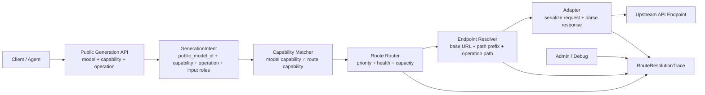

# 模型路由与 Adapter 改造计划

状态：实施中。本文档既是架构约束，也是后续验收清单；代码可以分阶段落地，但不能再引入新的 provider kind、模型名或 catalog template adapter 推断。

## 背景

MovScript 现在已经把模型模板、Provider / AI Account、Route Binding 和 Adapter 分开了，但视频模型接入开始暴露更细的问题：

- 同一个中转站会为不同模型入口设置不同 URL base 或 path prefix，例如 Yunwu 的 `/v1/video/create`、OpenAI 兼容 `/v1/videos`、官方 `/v1/videos/generations`、阿里百炼风格 `/alibailian/api/v1/services/aigc/video-generation/video-synthesis`。
- 有的能力不是单纯属于模型名，而是和入口 URL 绑定。例如首帧、尾帧、参考素材数量和角色、是否要求公网图片 URL、查询任务路径、是否异步轮询。
- 现有 route binding 只有 `adapter_type`、`provider_model_id`、`api_kinds` 等字段，无法表达 endpoint profile 和 route-level capability。
- 现有 Adapter 有 provider 身份和协议能力混在一起的倾向，例如把 `yunwu` 当作供应商 adapter，或在 `openai_compat` 内部用模型名启发式切到 xAI 官方视频接口。
- Admin 当前能配置 Provider、Catalog、Route，但还不能清楚展示“这条路由最终会打到哪个 URL、使用什么协议、支持哪些细粒度能力，以及为什么 router 选择了它”。

这份文档给出一次系统改造计划。目标不是马上实现全部功能，而是先确定边界，避免继续用模型名、provider kind 或临时 adapter 逻辑堆特殊分支。

## 总目标

把现在偏经验式的调用链：

```text
provider + adapter + model_id
```

升级为：

```text
request intent
  -> router 匹配 model capability + route capability
  -> 生成 effective endpoint
  -> adapter 负责协议序列化和响应解析
```

核心分工：

- 模型能力决定“能不能做”。
- 路由能力决定“从哪个入口做”。
- Adapter 决定“怎么发请求、怎么解析响应”。
- Provider / Credential 决定“用哪个账号、默认 host 和密钥”。
- Admin 负责让上述分工可见、可编辑、可诊断。

一句话原则：

```text
adapter 不选模型，provider 不选协议，router 根据能力和 endpoint 选 route。
```

再补一条模板边界：

```text
model template 不拥有 adapter；route template / route binding 才拥有 adapter。
```

Catalog / model template 只描述 MovScript public model identity、canonical capability、canonical params 和输入约束。它不能声明“这个模型应该用哪个 adapter”，否则会和 route binding 形成两个事实源。如果 registry 为了批量生成 route 仍需要一个建议值，只能使用 `route_adapter_hint` 这种明确的 bootstrap hint 名称；导入后必须物化成 route template 或 route binding，随后立即失去运行时语义。导入、启用和运行时路由都不能把 model template 的 route adapter hint 当作 adapter 决策来源，也不能作为模型能力校验依据。`route_adapter_hint` 不进入 Admin model template 响应和 Agent-facing API；Admin UI 中可见的 adapter 只能来自 Provider 默认值、route template 或 route binding。

## 非目标

- 不把中转站模型列表当作 MovScript 的 canonical model catalog。
- 不在 Adapter 内维护 provider 账号配置、路由优先级或 fallback 策略。
- 不把 provider-native 参数直接泄漏到 Agent contract 或普通生成 UI。
- 不要求第一阶段实现完整成本、价格、地区、SLA 路由。
- 不保留旧调用接口的运行时兼容推断；旧调用必须迁移为显式 `GenerationIntent`。

## 当前相关代码位置

- 模型目录和 route binding：`services/data-service/internal/infra/persistence/model/ai_model_catalog.go`
- Provider / Credential：`services/data-service/internal/infra/persistence/model/ai_provider.go`
- Catalog 运行时解析：`services/data-service/internal/infra/ai/service_model_catalog.go`
- Provider 构造：`services/data-service/internal/infra/ai/registry.go`
- Adapter 定义与参数：`services/data-service/internal/infra/ai/catalog.go`
- Registry YAML：`services/data-service/internal/infra/ai/model_registry/`
- Admin 模型管理页：`surface/admin/src/pages/admin/AdminPage.tsx`
- Admin 类型：`surface/admin/src/types/index.ts`
- Debug 调用日志页：`surface/admin/src/pages/admin/DebugPage.tsx`
- Desktop 工具调试面板：`apps/desktop/src/features/tools/components/ToolDialogJobPanels.tsx`

## 技术架构总览

改造后的技术主线是“Agent 只看模型和能力，后端隐藏 route 细节”。调用方不再把图片数量、provider kind、route id 或模型名当作隐含能力信号，而是显式给出 MovScript public model、本次要调用的能力域、operation 和输入资源 role。



核心组件职责：

| 组件 | 职责 | 不负责 |
| --- | --- | --- |
| Client / Agent | 声明 `public_model_id`、`capability`、`operation`、输入资源 role 和 canonical params | 选择 route、provider、adapter、endpoint、path prefix |
| Public Generation API | 把 Agent 的模型 + 能力请求归一化为 `GenerationIntent` | 暴露 route id、credential、adapter 或上游 URL |
| Capability Schema | 表达模型和路由支持的能力、输入、参数、媒体传输、任务生命周期 | 保存账号密钥或路由优先级 |
| Catalog Entry | 表达 MovScript public model identity 和 canonical model capability | 绑定具体账号 URL |
| Route Binding | 表达某个 provider endpoint 的 adapter、provider model id、endpoint profile 和 route capability | 定义模型对外身份 |
| Capability Matcher | 计算 model capability 与 route capability 的有效交集，给出 rejected reason | 发送上游请求 |
| Router | 在可用 route 中按能力、健康、优先级、容量选择最终 route | 在 adapter 内二次选择协议 |
| Endpoint Resolver | 统一处理 base URL、path prefix、operation path、`/v1` 去重和替换 | 根据模型名猜 endpoint |
| Adapter | 只做协议序列化、content type、响应解析、任务状态映射 | 决定该用哪条 route 或哪个账号 |
| Runner / Media Prep | 根据 route / adapter contract 准备 public URL、provider file id、inline data 等媒体输入 | 解释首帧/尾帧语义 |
| Admin / Debug | 展示可编辑配置、effective endpoint、route trace、request shape summary | 改写 Agent 的 public contract |

关键边界：

- `GenerationIntent` 是运行时入口的唯一合同；没有显式 `capability`、`operation` 和输入 role 的请求不进入 router。
- Agent-facing API 只暴露 MovScript public model 和 capability / operation；route binding、provider credential、adapter type、endpoint profile 都是 Admin / Debug 层的运行时细节。
- route 的 endpoint profile 是最终 URL 的权威来源；provider 只提供默认 host、默认 prefix 和 credential。
- route capability 默认用于收窄 catalog capability；如果未来要允许 route 补充 provider-specific 能力，必须有显式策略和审计。
- adapter registry 只回答“这个协议怎么发”，不能回答“这个模型该走哪条路由”。
- Debug 和 Admin 使用同一份 route resolution trace，避免线上故障只能靠 upstream error 猜原因。

## 目标领域模型

### Catalog Entry

`AIModelCatalogEntry` 继续表达 MovScript 对外稳定模型身份：

- `public_model_id`
- `display_name`
- lab / template 信息
- canonical capabilities
- canonical params
- 输入约束

后续应补充结构化能力字段，避免所有能力都塞进逗号分隔的 `capabilities` 和 `param_limits_json`：

```go
ModelCapabilitiesJSON string `gorm:"type:text;default:'{}'" json:"model_capabilities_json,omitempty"`
```

历史字段可以作为一次性数据迁移来源，但运行时不应依赖旧字段投影能力。迁移完成后，router 只读取结构化能力。

模型模板不应包含 `adapter_type`。如果 registry 仍需要批量生成默认 route，应新增 route template / combo template；模型模板源文件最多只能保留 `route_adapter_hint` 作为生成器 hint，且不能进入 Admin model template 响应或普通 Agent-facing API：

```yaml
model_templates:
  - id: xai:grok-imagine-video
    lab: xai
    model_id: grok-imagine-video
    capabilities:
      video_generation:
        operations: [prompt_to_video]

route_templates:
  - model_template_key: xai:grok-imagine-video
    provider_kind: xai_official
    adapter_type: official_video_generations
    endpoint:
      path_prefix: /v1
      operation_profile: generation
```

这样模型事实源和 route 事实源分开：同一个模型可以被 OpenAI-compatible 中转、官方 JSON 视频接口、Yunwu unified 接口或阿里百炼接口分别接入，但 public model capability 不会因为接入入口变化而漂移。

### Route Binding

`AIModelRouteBinding` 应从“provider model 绑定”升级为“能力入口绑定”。

建议新增字段：

```go
EndpointBaseURL     string `gorm:"default:''" json:"endpoint_base_url,omitempty"`
EndpointPathPrefix  string `gorm:"default:''" json:"endpoint_path_prefix,omitempty"`
EndpointMode        string `gorm:"default:'inherit'" json:"endpoint_mode,omitempty"`
OperationProfile    string `gorm:"default:'';index" json:"operation_profile,omitempty"`
RouteCapabilitiesJSON string `gorm:"type:text;default:'{}'" json:"route_capabilities_json,omitempty"`
```

字段语义：

- `endpoint_base_url`：可选。为空时继承 credential/provider 的 base URL host。
- `endpoint_path_prefix`：可选。表达这条 route 的入口前缀，例如 `/v1`、`/api/v1`、`/alibailian/api/v1`。
- `endpoint_mode`：建议值为 `inherit`、`replace_path`、`absolute`。
- `operation_profile`：可选。用于在同一 adapter 内选择操作族，例如 `generation`、`edit`、`extend`；查询路径属于 adapter / lifecycle contract。
- `route_capabilities_json`：route-level 能力声明，用于表达 endpoint 实际能力并收窄模型能力；最终可用能力等于 model capability 和 route capability 的交集。

### Provider / AI Account

`AIProvider` 和 credential 继续表达账号边界：

- provider kind / type / profile
- 默认 adapter
- 默认 base URL prefix
- credential 和密钥轮换
- asset library / trusted resource / health

Provider 可以提供默认值，但不应强制 route adapter。运行时应优先使用 route 自己的 `adapter_type`、endpoint profile 和 route capability。

### Adapter

Adapter 是协议实现，不是供应商身份。

建议收敛到这些协议族：

| Adapter | 语义 |
| --- | --- |
| `openai_compat` | OpenAI 兼容文本、图像等标准接口 |
| `openai_video_multipart` | OpenAI 风格 multipart 视频接口，例如 `/v1/videos` |
| `official_video_generations` | 官方 JSON 视频生成接口，例如 `/v1/videos/generations` |
| `yunwu_unified_video` | Yunwu 特有统一视频接口，例如 `/v1/video/create` 和 `/v1/video/query` |
| `dashscope_video` 或 `alibailian_video` | 阿里百炼 / DashScope 原生视频协议 |

迁移脚本可以识别历史值：

```text
yunwu -> yunwu_unified_video
```

但运行时不应继续接受 `yunwu` 作为 adapter 类型，也不应让 `ProviderKindYunwuGateway` 自动覆盖 route adapter。云雾是账号/中转站，`yunwu_unified_video` 才是协议入口。

### Effective Route Endpoint

router 最终应产出一个明确的 endpoint，而不是让 Adapter 自己猜：

```go
type EffectiveRouteEndpoint struct {
	AdapterType      string
	ProviderModelID  string
	BaseURL          string
	PathPrefix       string
	OperationPath    string
	OperationProfile string
	QueryPath        string
}
```

URL 组合规则：

```text
final_url = normalized_base_url + normalized_path_prefix + adapter_operation_path
```

示例：

| 场景 | Base URL | Path Prefix | Operation Path | Final URL |
| --- | --- | --- | --- | --- |
| OpenAI | `https://api.openai.com` | `/v1` | `/chat/completions` | `https://api.openai.com/v1/chat/completions` |
| OpenRouter | `https://openrouter.ai` | `/api/v1` | `/chat/completions` | `https://openrouter.ai/api/v1/chat/completions` |
| Yunwu unified | `https://yunwu.ai` | `/v1` | `/video/create` | `https://yunwu.ai/v1/video/create` |
| Yunwu Alibaba | `https://yunwu.ai` | `/alibailian/api/v1` | `/services/aigc/video-generation/video-synthesis` | `https://yunwu.ai/alibailian/api/v1/services/aigc/video-generation/video-synthesis` |

注意：credential 里如果已经填了带 path 的 base URL，例如 `https://api.example.com/v1`，`endpoint_mode=replace_path` 时必须去重并替换 path，避免生成 `/v1/v1`。

## Capability 扩展模型

现有 `capabilities` 更像能力标签，例如 `text`、`image`、`video_i2v`。这些旧标签只能作为一次性数据迁移输入，不能继续作为 router 的运行时判断依据。真正供 router、runner、Admin 使用的能力应扩成结构化对象。

建议把 capability 分成三层：

```text
capability family  -> market operation  -> constraints / transport / lifecycle
```

例如：

```text
video_generation -> first_last_frame_to_video -> reference_assets.roles + endpoint + async query
```

### 通用维度

每个能力域都尽量使用同一批通用维度，避免每个 adapter 自己发明字段：

| 维度 | 说明 | 例子 |
| --- | --- | --- |
| `operations` | 这条能力面向用户/市场的生成模式 | `reference_to_video`、`image_to_image`、`voice_clone` |
| `inputs` | 输入资源类型、数量、角色和格式 | text、image、video、audio、file、first_frame |
| `outputs` | 输出资源类型、格式、数量和限制 | image/png、video/mp4、audio/wav |
| `params` | canonical 参数约束 | aspect ratio、duration、quality、seed |
| `transport` | 媒体怎么传给上游 | inline data、public URL、provider asset URI、files API |
| `lifecycle` | 同步还是异步，是否需要查询 | sync、async、query path、poll timeout |
| `safety` | 安全、审查或水印限制 | safety level、watermark、content policy |
| `limits` | 速率、上下文、大小、时长上限 | context window、file size、duration |

### 能力域清单

UI 可以分阶段实现，但 schema 要一次性覆盖当前主流模型市场已经稳定出现的能力，避免后续每接一个模型就重新改能力名。

| 能力域 | 需要表达的能力 |
| --- | --- |
| `text_generation` | chat、responses、agentic task、streaming、tool calling、structured output、JSON schema、reasoning、vision input、file input、audio input、context window |
| `image_generation` | text-to-image、image-to-image、多参考图、局部编辑、inpaint、outpaint、variation、style transfer、角色/产品一致性、背景替换、超分、尺寸、比例、质量、输出格式 |
| `video_generation` | 文生视频、全能参考生视频、图生视频、首帧生视频、首尾帧生视频、视频转视频、视频编辑、扩展、局部重绘、对象添加/移除、运动控制、音频/口型同步、upscale、参考素材角色、时长、比例、分辨率、异步查询 |
| `audio_generation` | TTS、STT、translate、realtime voice、audio chat、voice clone、voice design、dubbing、music、SFX、speech enhancement、输入音频数量、采样率、输出格式 |
| `embedding` | 文本/图片/多模态 embedding、向量维度、batch size、归一化、用途标签 |
| `rerank` | query/document 输入、top k、score 输出、多语言、长文档 |
| `moderation` | 文本/图片/音频/视频审核、分类标签、阈值、同步/异步审核 |
| `asset_transport` | public URL、signed URL、inline base64、multipart upload、provider file id、provider asset URI、预上传能力 |
| `task_lifecycle` | async task id、query endpoint、cancel、retry、progress、provider status mapping、webhook / callback |

### 主流能力基线

下面的 operation 名称是 MovScript 的 canonical vocabulary。上游文档可以叫 `text-to-video`、`image-to-video`、`ingredients`、`first/last frame`、`extend` 或 `edit`，进入 MovScript 后都应映射到这些稳定 operation，再由 constraints 描述具体输入字段。

能力基线的维护可以参考官方 API 文档，但不把任何外部模型目录作为 truth source：

- OpenAI image / realtime / speech 文档用于校验图像生成编辑、图文输入、实时语音和转写能力。
- Runway API 文档用于校验视频生成、视频编辑、upscale、角色控制、音频和任务管理能力。
- 阿里百炼 / DashScope 文档用于校验文生视频、图生视频、首帧、首尾帧、参考生视频、视频续写和异步任务能力。
- ElevenLabs 文档用于校验 TTS、STT、voice clone、voice design、dubbing、music、SFX 和 conversational agent 能力。

`text_generation.operations`：

| Operation | 中文名 | 关键约束 |
| --- | --- | --- |
| `chat` | 对话生成 | messages、system/developer/user 角色、streaming |
| `responses` | 通用响应生成 | 多模态 input、output item、tool calling |
| `agent_task` | Agent 任务执行 | tool set、browser/computer/file 能力、max steps |
| `vision_chat` | 图文理解对话 | image input count、image detail、OCR/视觉问答 |
| `audio_chat` | 语音/音频对话 | audio input、audio output、realtime / batch |
| `structured_output` | 结构化输出 | JSON schema、strict mode、schema size |
| `reasoning` | 推理生成 | reasoning effort、thinking tokens、budget |

`image_generation.operations`：

| Operation | 中文名 | 关键约束 |
| --- | --- | --- |
| `text_to_image` | 文生图 | prompt、aspect ratio、size、quality、seed |
| `image_to_image` | 图生图 | reference image、strength、style fidelity |
| `reference_to_image` | 多参考生图 | reference images、roles、character/product/style consistency |
| `image_edit` | 图像编辑 | edit prompt、target image、mask 可选 |
| `inpaint` | 局部重绘 | mask required、target image |
| `outpaint` | 扩图 | canvas / padding / target aspect ratio |
| `variation` | 变体 | source image、variation count |
| `style_transfer` | 风格迁移 | style reference、content reference |
| `background_replace` | 背景替换 | subject preservation、mask / alpha |
| `upscale` | 超分辨率 | scale、target resolution、artifact removal |

`video_generation.operations`：

| Operation | 中文名 | 关键约束 |
| --- | --- | --- |
| `prompt_to_video` | 文生视频 | prompt、duration、aspect ratio、resolution |
| `reference_to_video` | 全能参考生视频 | image/video/audio references、roles、reference strength |
| `image_to_video` | 图生视频 | generic image reference，不承诺首帧锁定 |
| `first_frame_to_video` | 首帧生视频 | `first_frame` image required |
| `first_last_frame_to_video` | 首尾帧生视频 | `first_frame` + `last_frame` images required |
| `video_to_video` | 视频转视频 | input video、style/motion transform |
| `video_edit` | 视频编辑 | input video、edit prompt、mask / region 可选 |
| `video_extend` | 视频延展 | input video、extend direction、duration |
| `video_inpaint` | 视频局部重绘 | input video、temporal mask / region |
| `object_insert` | 添加对象 | object reference、placement / time range |
| `object_remove` | 移除对象 | mask / target description、time range |
| `motion_control` | 运动控制 | camera path、pose、trajectory、motion brush |
| `lip_sync` | 口型同步 / 配音视频 | input video / image、speech audio、voice sync |
| `video_upscale` | 视频超分 | target resolution、frame rate、artifact removal |

`audio_generation.operations`：

| Operation | 中文名 | 关键约束 |
| --- | --- | --- |
| `tts` | 文本转语音 | voice、language、speed、format |
| `stt` | 语音转文字 | audio input、timestamps、speaker diarization |
| `speech_translate` | 语音翻译 | source / target language、timestamps |
| `audio_chat` | 音频对话 | audio input/output、realtime / batch |
| `voice_clone` | 声音克隆 | reference audio、consent / trust、voice id |
| `voice_design` | 声音设计 | text description、gender/age/style controls |
| `dubbing` | 配音 / 翻配 | source video/audio、target language、timing |
| `music` | 音乐生成 | prompt、duration、lyrics、style、loop |
| `sfx` | 音效生成 | prompt、duration、sync marker |
| `speech_enhancement` | 语音增强 | denoise、dereverb、loudness、format |

`asset_transport` 和 `task_lifecycle` 不直接暴露给普通用户选择，但它们决定 route 是否可用：

| 域 | 必备建模点 |
| --- | --- |
| `asset_transport.input_media` | `public_url`、`signed_url`、`inline_base64`、`multipart_file`、`provider_file_id`、`provider_asset_uri` |
| `asset_transport.output_media` | `url`、`base64`、`provider_file_id`、`provider_asset_uri`、`task_result_url` |
| `task_lifecycle.result_mode` | `sync`、`async`、`stream` |
| `task_lifecycle.query` | query path、HTTP method、id param、poll interval、timeout、status mapping |
| `task_lifecycle.cancel` | cancel path、是否支持取消 |
| `task_lifecycle.callback` | webhook / callback URL 支持 |

推荐 schema 形态：

```yaml
capabilities_json:
  text_generation:
    operations:
      - chat
      - responses
      - vision_chat
      - structured_output
    features:
      - streaming
      - tool_calling
      - structured_output
    inputs:
      text:
        required: true
      image:
        max: 4
    limits:
      context_window_tokens: 128000

  image_generation:
    operations:
      - text_to_image
      - image_to_image
      - reference_to_image
      - image_edit
      - inpaint
      - outpaint
      - upscale
    reference_images:
      min: 0
      max: 8
      roles:
        - generic
        - style
        - character
    masks:
      supported: true
    aspect_ratios:
      - "1:1"
      - "16:9"
      - "9:16"
    output_formats:
      - png
      - jpeg

  video_generation:
    operations:
      - prompt_to_video
      - reference_to_video
      - image_to_video
      - first_frame_to_video
      - first_last_frame_to_video
      - video_to_video
      - video_edit
      - video_extend
      - video_inpaint
      - object_insert
      - object_remove
      - motion_control
      - lip_sync
      - video_upscale
    reference_assets:
      min: 0
      max: 8
      modalities:
        - image
        - video
        - audio
      roles:
        - generic
        - first_frame
        - last_frame
        - reference_video
        - reference_audio
        - style
        - character
        - product
        - motion
        - mask
    duration:
      min_seconds: 1
      max_seconds: 15
    aspect_ratios:
      - "1:1"
      - "16:9"
      - "9:16"
    resolutions:
      - "720p"
      - "1080p"
    result_mode: async

  audio_generation:
    operations:
      - tts
      - stt
      - speech_translate
      - audio_chat
      - voice_clone
      - voice_design
      - dubbing
      - music
      - sfx
      - speech_enhancement

  asset_transport:
    input_media:
      - public_url
      - signed_url
      - inline_base64
      - multipart_file
      - provider_file_id
    output_media:
      - url
      - provider_asset_uri
    requires_public_image_url: false

  task_lifecycle:
    result_mode: async
    query:
      method: GET
      path: /v1/video/query
      id_location: query.id
      poll_interval_ms: 2000
      poll_timeout_ms: 600000
```

### Model Capability 与 Route Capability

能力可以挂在两个位置：

- model capability：这个 MovScript public model 在语义上应该支持什么。
- route capability：某个 provider endpoint 实际能支持什么。

最终 router 使用的是两者交集：

```text
effective_capability = model_capability ∩ route_capability
```

举例：

```text
模型声明支持 image_to_video 和 first_last_frame_to_video。
Route A 走 /v1/video/create，只支持普通 images 数组。
Route B 走 /v1/videos/generations，支持 reference_assets 的首尾帧语义。

首尾帧请求只能选 Route B。
普通图生视频请求可以选 Route A 或 Route B。
```

### 视频 Operation 标签

`video_generation.operations` 应优先按市场主流的生成模式命名，而不是按底层输入技术命名。其中用于参考素材生成视频的主标签保持四个：

| Operation | 中文名 | 语义 | 典型输入 |
| --- | --- | --- | --- |
| `reference_to_video` | 全能参考生视频 | 使用多模态参考素材生成视频，参考可以包含图片、视频、音频 | prompt + images/videos/audio references |
| `image_to_video` | 图生视频 | 使用普通图片参考生成视频，不承诺首帧锁定 | prompt + generic image |
| `first_frame_to_video` | 首帧生视频 | 输入图片明确作为视频首帧 | prompt + first_frame image |
| `first_last_frame_to_video` | 首尾帧生视频 | 输入图片明确作为首帧和尾帧 | prompt + first_frame image + last_frame image |

纯文生视频使用 `prompt_to_video`。它是独立 operation，不要和参考类 operation 混在一起。`text_to_video` 是上游常见叫法，但在 MovScript canonical vocabulary 中统一写成 `prompt_to_video`；`video_to_video` 可以保留，因为它已经是市场上清晰的编辑/转换模式。

这些 operation 只描述“用户想调用哪种生成模式”。能接收哪些素材类型、素材数量、素材 role、是否需要公网 URL、是否异步查询，都应该写在 constraints 里。`reference_to_video` 可以接图片，但它表达的是“全能参考生视频”的市场模式，不等于普通 `image_to_video`；即使素材都是图片，客户端也必须按用户意图显式选择 operation。

### 旧标签一次性迁移映射

旧字段不再参与运行时兼容，只允许在 migration / registry generator 中一次性转换为结构化能力：

| 旧标签 / 字段 | 迁移目标 |
| --- | --- |
| `text` | `text_generation.operations=[chat]` |
| `image` | `image_generation.operations=[text_to_image]` |
| `image_edit` | `image_generation.operations=[image_to_image,inpaint]`，具体能力需 route 收窄 |
| `video` | `video_generation.operations=[prompt_to_video]`，仅表示基础文生视频能力 |
| `video_i2v` | `video_generation.operations=[image_to_video]` |
| `video_v2v` | `video_generation.operations=[reference_to_video]`，并收窄 `reference_assets.modalities=[video]` |
| `audio_tts` | `audio_generation.operations=[tts]` |
| `audio_stt` | `audio_generation.operations=[stt]` |
| `audio_music` | `audio_generation.operations=[music]` |
| `audio_sfx` | `audio_generation.operations=[sfx]` |
| `voice_clone` | `audio_generation.operations=[voice_clone]` |
| `accepts_image` | 输入 image 存在，但不推断具体角色 |
| `max_input_images` | `reference_assets.max` + `reference_assets.modalities=[image]`，但不自动推断首尾帧 |
| `max_input_videos` | `input_videos.max` |

### 实现优先级

schema 需要覆盖上面的完整能力基线；实现可以分层推进。第一批代码优先实现会直接影响路由正确性的字段：

1. `operations`
2. `reference_assets.min/max/modalities/roles`
3. `asset_transport.input_media` 和 public URL 要求
4. `aspect_ratios`、`duration`、`resolutions` / `sizes`
5. `task_lifecycle.result_mode` 和 `task_lifecycle.query`

其余能力可以先只在 catalog / route schema 和 Admin 预览中可表达，等对应 adapter 接入时再启用测试表单和 runner 支持。

## Agent 调用模型

Agent 和普通客户端面对的是 MovScript 的模型能力层，不是 route 层。它们只需要回答：

```text
我要用哪个 MovScript 模型 -> 我要调用哪种能力/operation -> 这次输入分别是什么角色
```

因此 Agent-facing contract 必须隐藏这些字段：

- `route_binding_id`
- `provider_id` / `credential_id`
- `adapter_type`
- `endpoint_base_url`
- `endpoint_path_prefix`
- `operation_profile`
- 上游 provider-native request body

这些字段只允许出现在 Admin、Debug、route diagnose 和后端日志中。Agent 可以收到抽象诊断，例如“当前模型没有可用通道支持首尾帧生视频”或“当前账号缺少公网媒体传输能力”，但不应该被要求理解 `/v1/video/create`、`/alibailian/api/v1` 或 multipart / JSON 协议差异。

## 按能力调用模型

调用模型时也应按能力调用。客户端必须显式声明本次要使用的能力域和 operation mode，不能只传 `model_id`、prompt 和资源列表，让后端根据输入数量或顺序猜测。

最小调用合同：

```json
{
  "model_id": "grok-imagine-video",
  "capability": "video_generation",
  "operation": "first_last_frame_to_video",
  "inputs": {
    "prompt": "生成短剧式漫画视频场景...",
    "reference_assets": [
      { "role": "first_frame", "resource_id": 101 },
      { "role": "last_frame", "resource_id": 102 }
    ]
  },
  "params": {
    "aspect_ratio": "9:16",
    "duration_seconds": 8,
    "resolution": "720p"
  }
}
```

普通泛参考图生视频应显式表达为另一种 operation / role：

```json
{
  "model_id": "grok-video-3",
  "capability": "video_generation",
  "operation": "image_to_video",
  "inputs": {
    "prompt": "生成短剧式漫画视频场景...",
    "reference_assets": [
      { "role": "generic", "resource_id": 201 },
      { "role": "generic", "resource_id": 202 }
    ]
  }
}
```

关键规则：

- `capability` 必填，例如 `video_generation`、`image_generation`、`audio_generation`、`text_generation`。
- `operation` 必填，例如 `first_last_frame_to_video`、`first_frame_to_video`、`image_to_video`、`reference_to_video`、`inpaint`、`voice_clone`。
- 输入资源必须带 role，例如 `generic`、`first_frame`、`last_frame`、`mask`、`style`、`character`。
- router 只能根据显式 intent 匹配 route，不应根据“两张图”推断首尾帧。
- 如果客户端没有声明 operation，直接返回 `missing_operation_intent`。
- 如果客户端没有声明输入 role，直接返回 `missing_input_role`。
- 如果资源 role 和 operation 不匹配，例如 `operation=first_last_frame_to_video` 但没有 `last_frame`，应返回 `invalid_operation_inputs`。

这样 Agent / 客户端和后端 runner 的心智是一致的，但分层不同：

```text
Agent: 我要调用哪个模型的什么能力 -> 这次输入分别是什么角色
Backend: router 找到能完成该能力的 route -> adapter 序列化成上游协议
```

### GenerationIntent 合同

```go
type GenerationIntent struct {
	PublicModelID string
	Capability string
	Operation  string
	Inputs     GenerationInputs
	Params     map[string]any
}
```

`GenerationIntent` 是运行时唯一入口，但它仍然是 public model + capability 层的合同，不包含 route / provider / adapter / endpoint 字段。旧接口、旧 UI 或旧 Agent tool 如果还只能传 `model_id`、prompt 和资源数组，必须先升级调用方；后端不再做兼容推断。

明确禁止：

- 两张图片自动等于首尾帧。
- 第一张图片自动等于首帧，第二张图片自动等于尾帧。
- 供应商支持 `reference_images` 或 `images` 数组就自动等于支持首尾帧。
- 选择某个 provider kind 就自动决定 operation。

## 视频能力建模

视频能力应从粗粒度 `video`、`video_i2v` 变成结构化能力。其中 `operations` 使用市场/产品语义，constraints 再描述技术参数。

建议 canonical schema：

```yaml
video_generation:
  operations:
    - prompt_to_video
    - reference_to_video
    - image_to_video
    - first_frame_to_video
    - first_last_frame_to_video
    - video_to_video
    - video_edit
    - video_extend
    - video_inpaint
    - object_insert
    - object_remove
    - motion_control
    - lip_sync
    - video_upscale
  reference_assets:
    min: 0
    max: 8
    modalities:
      - image
      - video
      - audio
    roles:
      - generic
      - first_frame
      - last_frame
      - reference_video
      - reference_audio
      - style
      - character
      - product
      - motion
      - mask
  input_videos:
    min: 0
    max: 1
  duration:
    min_seconds: 1
    max_seconds: 15
  aspect_ratios:
    - "1:1"
    - "16:9"
    - "9:16"
  resolutions:
    - "720p"
    - "1080p"
  requires_public_image_url: true
  requires_public_video_url: true
  result_mode: async
  query:
    adapter_operation: query
    poll_interval_ms: 2000
    poll_timeout_ms: 600000
```

关键点：

- 首帧、尾帧是模型/路由能力，不是 runner 临时判断。
- “参考素材数组”或上游 `images` 字段不一定等价于“首尾帧语义”，需要由 operation 和 route capability 明确 roles。
- “全能参考生视频”不是一个更大的技术参数桶，而是市场 operation；它下面仍要声明可接收的 reference modalities 和 roles。
- `requires_public_image_url` 由 route 或 adapter contract 声明，runner 只执行媒体准备。
- 查询任务路径、轮询策略也属于 route/adapter contract，不能只在生成请求里隐含。

最终有效能力：

```text
effective_capability = model_capability ∩ route_capability
```

如果 route 没有声明更细能力，运行时应视为能力不完整并拒绝进入 router。旧字段只能通过 migration 或 registry generator 生成结构化能力：

- `accepts_image=true`、`max_input_images=1` -> `image_to_video` 或图像输入上限。
- `max_input_images>=2` 且 route 明确 roles -> 允许 `first_last_frame_to_video`。
- `capabilities` 包含 `video_i2v` -> 至少允许普通 image-to-video。

不要默认把 `max_input_images=2` 推断成首尾帧能力。

## Router 选择流程

router 输入不应只是 model id，而应先归一化成客户端显式声明的请求意图。这个意图至少包含 `capability`、`operation`、输入资源角色和 canonical params。

示例：

```go
type VideoIntent struct {
	Capability          string
	Operation           string
	ReferenceAssetCount int
	HasFirstFrame       bool
	HasLastFrame        bool
	InputVideoCount     int
	AspectRatio         string
	Resolution          string
	DurationSeconds     int
	RequiresPublicMedia bool
}
```

匹配流程：

1. 校验请求是否声明 `capability` 和 `operation`。
2. 根据 public model id / route group 找到启用的 catalog entry。
3. 合并 entry capability 和每条 route capability。
4. 过滤不支持请求 capability / operation 的 route。
5. 过滤参考素材数量、素材 modalities、首尾帧 roles、视频输入数量不满足的 route。
6. 过滤 aspect ratio、resolution、duration 不满足的 route。
7. 检查媒体 URL 要求，确认当前 storage / files API / public relay 能满足。
8. 应用运行时健康、并发、priority、capacity weight 和 cooldown。
9. 产出 `RouteResolutionTrace`，记录被过滤和被选中的原因。

失败时应返回可解释错误：

```text
missing_operation_intent
missing_input_role
invalid_operation_inputs
missing_route_capability:first_last_frame_to_video
unsupported_aspect_ratio:9:16
requires_public_image_url
endpoint_not_configured
adapter_not_supported
```

这些错误要给 Admin、Desktop 工具面板和 Agent diagnostics 共用。
其中 Agent diagnostics 只能暴露 public model / capability 层的错误和行动建议；route id、adapter、endpoint URL、credential 只进入 Admin / Debug 诊断。

## Admin 改造

Admin 的目标是把“账号、模型身份、路由入口、能力差异、运行时选择结果”讲清楚，并允许高级用户在不改代码的情况下修正中转站入口变化。

### API 账号管理

位置：`/models/providers`

职责：

- 管理 AI Account / Provider。
- 管理 credential、key、base URL 默认 host、密钥轮换。
- 展示 provider 默认 adapter 和默认 path prefix，但明确标注为“默认值”。
- 展示 provider 支持的能力包，例如 asset library、files API、public media relay。
- 不在账号页决定具体模型 route 的 adapter 和 endpoint。

需要新增或调整：

- Provider 列表展示 `base_url_prefix`、默认 adapter、credential 健康。
- 账号详情增加“默认 endpoint profile”只读/高级编辑。
- 对中转站账号提示：不同模型入口可能使用不同 route endpoint，以路由页为准。
- Yunwu 账号提供一键接入流程：
  - 用户只输入 API key 和可选 base URL。
  - 系统根据 Yunwu provider profile / registry templates 生成当前 Yunwu API 覆盖的模型、endpoint profile、adapter type 和 route capability。
  - 对无法自动确认能力的模型，生成 disabled route 和待补全诊断，不要求用户手工拼 URL 才能发现问题。
- 连接测试分两层：
  - credential 基础连通性测试。
  - route endpoint 测试入口跳转到路由页执行。

### 模型管理

位置：`/models/catalog`

职责：

- 管理 MovScript public model identity。
- 管理模型的 canonical capability 和参数。
- 不绑定具体账号 URL。

需要新增：

- 结构化能力编辑器，按能力域分组：
  - video：主流 video operations、reference asset modalities/min/max/roles、duration、aspect ratios、resolutions / sizes、motion / mask / lip-sync 约束、result mode。
  - image：主流 image operations、reference image roles、mask、局部编辑、style/product/character consistency、aspect ratios、output formats。
  - audio：TTS/STT/realtime/audio chat/music/SFX/voice clone/dubbing 等 operation、输入音频限制、输出格式。
  - text：chat/responses/agent task、streaming、tool calling、structured output、reasoning、vision/file/audio input、context window。
  - transport：public URL、files API、provider file id、provider asset URI。
- 从旧字段生成结构化能力的迁移预览，标注“仅用于数据迁移，不参与运行时”。
- 能力验证：
  - 首尾帧必须有 `reference_assets.roles`。
  - `first_last_frame_to_video` 至少需要 `reference_assets.max >= 2`，除非 adapter 明确支持单字段首尾帧。
  - `video_edit` 必须声明 input video 上限。
- 能力完整性验证：
  - catalog entry 必须至少声明一个能力域和一个 operation。
  - route binding 必须声明它实际可用的 operation；空 route capability 不能发布为启用 route。
  - 如果 route 声明了 catalog 不存在的 operation，需要 Admin 显示冲突并阻止保存，除非后续引入显式补充策略。
- 模板导入时填充结构化能力，但 route-specific 能力仍由 route binding 覆盖。
- 模型调用预览必须展示“默认 operation”是否唯一；如果不唯一，Admin 不应生成无 operation 的测试请求。

### 路由管理

位置：`/models/routes`

职责：

- 管理每条 model route 的 provider、adapter、endpoint profile、provider model id、priority、capacity 和 route capability。
- 展示 runtime 会如何选择候选。

需要新增：

- Route 表单字段：
  - `adapter_type`
  - `provider_model_id`
  - `endpoint_mode`
  - `endpoint_base_url`
  - `endpoint_path_prefix`
  - `operation_profile`
  - `route_capabilities_json`
- Effective URL 预览：

```text
https://yunwu.ai + /alibailian/api/v1 + /services/aigc/video-generation/video-synthesis
```

- Adapter operation 预览：
  - create path
  - query path
  - request content type
  - result parser
- Route capability 编辑器：
  - 默认继承模型能力。
  - 支持收窄，如只支持 `image_to_video`，不支持 `first_last_frame_to_video`。
  - 支持声明 `requires_public_image_url`。
- Route matrix 增强：
  - 当前运行池继续展示 priority / capacity。
  - 每个候选显示 adapter、effective URL、operation profile、关键能力 chips。
  - 对能力不完整或 endpoint 缺失的 route 显示 warning。
- 路由诊断按钮：
  - 输入一个模拟 intent，例如“首尾帧、9:16、8 秒、2 张图”。
  - 显示哪些 route 被过滤、原因是什么、最终选中哪条。
- Route 测试表单必须先选择 capability / operation，再选择输入资源 role；不能只上传多张图后让系统猜。

### Debug 页面

位置：`/debug`

职责：

- 让失败请求能被定位到 request intent、route decision、effective endpoint 和 adapter serialization。

需要新增：

- 调用日志中保存并展示：
  - public model id
  - capability / operation
  - provider model id
  - route binding id
  - adapter type
  - operation profile
  - sanitized effective URL
  - route resolution trace
  - request content type
  - request shape summary
- 对 multipart 请求，区分真实 curl 和 debug summary：
  - 如果没有真实 multipart body，不展示“复制 curl”。
  - 展示“multipart summary 仅用于诊断，不是可直接执行请求体”。
- 错误详情增加 route mismatch 信息：
  - 模型不支持某能力。
  - route endpoint 不支持某能力。
  - provider key / URL 配置问题。
  - upstream 返回错误。

### Desktop 工具面板

位置：`apps/desktop/src/features/tools/components/ToolDialogJobPanels.tsx`

职责：

- 给使用工具的用户和 Agent 看简化诊断，不暴露复杂 Admin 细节。

需要新增：

- 工具入口显式选择或固定 capability / operation，例如 `video_generation:first_last_frame_to_video`。
- 默认只显示 public model、capability / operation 和能力模式，例如 `first_last_frame_to_video`。
- route provider、adapter、effective URL 只在 Admin Debug 链接或高级诊断中展示，不作为 Agent 可见合同。
- 如果失败是能力路由问题，给出可行动提示：
  - Agent / 普通用户：“当前模型没有可用通道支持首尾帧生视频，请在模型设置中启用对应能力。”
  - Agent / 普通用户：“当前模型需要公网媒体传输能力，请先配置媒体访问方式。”
  - Admin 详情：“被拒绝 route 15 缺少 `first_last_frame_to_video`，route 18 缺少 public URL transport。”
- 保持 debug curl 保护逻辑：只有真实可复现请求才允许复制。

### Admin 类型和 API 合同

需要同步更新：

- `surface/admin/src/types/index.ts`
  - `AIModelRouteBinding` 增加 endpoint 和 route capabilities 字段。
  - `AIModelCatalogEntry` / `AIModelCatalogTemplate` 增加结构化能力字段。
  - `RuntimeProviderHealth` 增加 route endpoint / operation profile 摘要。
- Admin API：
  - `GET /admin/model-catalog`
  - `POST /admin/model-catalog`
  - `PUT /admin/model-catalog/:id`
  - `POST /admin/model-catalog/:id/routes`
  - `PUT /admin/model-catalog/:id/routes/:route_id`
  - `GET /admin/model-runtime-health`
  - 新增或扩展 route diagnostic endpoint。

建议新增诊断接口：

```text
POST /admin/model-routes/diagnose
```

请求：

```json
{
  "public_model_id": "grok-imagine-video",
  "route_group": "default",
  "capability": "video_generation",
  "intent": {
    "operation": "first_last_frame_to_video",
    "reference_assets": [
      { "role": "first_frame", "media_type": "image" },
      { "role": "last_frame", "media_type": "image" }
    ],
    "aspect_ratio": "9:16",
    "duration_seconds": 8
  }
}
```

响应：

```json
{
  "selected_route_id": 12,
  "effective_endpoint": {
    "adapter_type": "official_video_generations",
    "base_url": "https://api.x.ai",
    "path_prefix": "/v1",
    "operation_path": "/videos/generations"
  },
  "candidates": [
    {
      "route_id": 12,
      "status": "selected",
      "reasons": []
    },
    {
      "route_id": 15,
      "status": "rejected",
      "reasons": ["missing_route_capability:first_last_frame_to_video"]
    }
  ]
}
```

## YAML 和模板改造

Registry YAML 要继续按 lab 组织模型模板，provider-only 中转站仍放在 `providers.yaml` 和 route binding。

模型模板可以增加：

```yaml
route_adapter_hint: openai_compat # 仅用于 registry/bootstrap；route 生成后不再具备运行时语义
capabilities_json:
  video_generation:
    operations:
      - reference_to_video
      - image_to_video
    reference_assets:
      min: 0
      max: 1
```

Combo / route 模板可以增加：

```yaml
endpoint:
  mode: inherit
  path_prefix: /v1
  operation_profile: generation
route_capabilities:
  video_generation:
    operations:
      - image_to_video
    requires_public_image_url: true
```

Yunwu 示例：

```yaml
providers:
  - provider_kind: yunwu_gateway
    provider_category: aggregator_gateway
    default_adapter_type: openai_compat
    default_base_url_prefix: https://yunwu.ai/v1

routes:
  - provider_kind: yunwu_gateway
    adapter_type: yunwu_unified_video
    provider_model_id: grok-video-3
    endpoint:
      mode: inherit
      path_prefix: /v1
      operation_profile: generation
    route_capabilities:
      video_generation:
        operations:
          - image_to_video
        reference_assets:
          min: 0
          max: 1
          modalities:
            - image
        aspect_ratios:
          - "1:1"
          - "3:2"
          - "2:3"
        sizes:
          - "720P"

  - provider_kind: yunwu_gateway
    adapter_type: dashscope
    provider_model_id: ali-video-model
    endpoint:
      mode: inherit
      path_prefix: /alibailian/api/v1
      operation_profile: synthesis
    route_capabilities:
      video_generation:
        operations:
          - reference_to_video
          - image_to_video
        reference_assets:
          modalities:
            - image
            - video
            - audio
```

## OpenMontage 可吸收点

参考项目：`calesthio/OpenMontage`。它的核心不是模型目录系统，而是“工具合同 + 自动发现 + selector 排名”。这和 MovScript 的 Catalog / Route / Adapter 边界不同，但有几类元数据和诊断方式值得吸收。

### 值得吸收

OpenMontage 的 `BaseTool` 把每个生成、分析、编辑工具都声明成一个 support envelope，字段包括 identity、capability、provider、runtime、stability、dependencies、input/output schema、supports、best_for、not_good_for、resource_profile、retry_policy、idempotency、side_effects、cost/runtime estimate、user-visible verification 等。MovScript 可以吸收为 route / adapter / provider health 的扩展元数据：

```yaml
route_operational_profile:
  runtime: api
  stability: beta
  dependencies:
    credential: YUNWU_API_KEY
    network_required: true
  cost:
    unit: second
    estimate_mode: provider_rate_table
  latency:
    p50_seconds: 60
    timeout_seconds: 600
  retry_policy:
    max_retries: 2
    retryable_errors:
      - rate_limit
      - timeout
  idempotency_key_fields:
    - prompt_hash
    - operation
    - provider_model_id
  side_effects:
    - creates_remote_task
    - writes_raw_resource
  user_visible_verification:
    - inspect_video_motion
    - inspect_audio_sync
```

OpenMontage 的 registry 可以按 capability / provider 输出 provider menu，区分 available / unavailable，并给出 setup offers。MovScript 的 Admin 可以吸收这个产品形态：

- Provider 页显示“这个账号当前解锁了哪些能力”。
- Route 页显示“当前能力有几条可用 route、几条缺 credential / endpoint / capability”。
- Yunwu onboarding 显示“只给 API key 后已同步多少模型、禁用了哪些缺映射模型、下一步怎么补”。
- Debug 页保留 route resolution trace，同时展示 alternatives considered。

OpenMontage 的 selector 支持 `rank` 模式，只返回候选供应商排序而不执行生成；排序维度包括 task fit、output quality、control、reliability、cost efficiency、latency、continuity。MovScript 不应该照搬 selector 工具，但可以把这些维度变成 router 的第二阶段解释性评分：

```text
hard filters:
  capability / operation / input roles / endpoint / media transport / health

soft ranking:
  priority / capacity / reliability / cost / latency / continuity / user preference
```

这样可以保证“能力不匹配绝不降级”，同时让 Admin 解释为什么在多个可用 route 中选了某一条。

OpenMontage 的 provider-specific video tool 会把 operation 映射到不同 endpoint，例如 `text_to_video`、`image_to_video`、`reference_to_video`、`first_last_frame_to_video` 对应不同 API path。这进一步验证了 MovScript 的设计方向：operation path 是 route / adapter contract 的一部分，不应该藏在模型名启发式里。

OpenMontage 的 contract tests 会检查工具 identity、capability、provider、registry discovery、status、cost estimate 和 schema。MovScript 可以增加对应测试：

- 所有启用 route 必须有 `adapter_type`、endpoint profile、provider model id、route capability。
- 所有 adapter 必须声明 supported operations、operation paths、content type、media transport、lifecycle。
- Admin provider menu / route matrix 的 configured / total / unavailable 统计必须可测试。
- Router diagnose 必须返回 selected route、rejected reasons、alternatives considered 和软评分。

### 不宜照搬

- OpenMontage 把 provider、tool、model 和 endpoint 经常放在同一个 Python class 里；MovScript 需要继续保持 Catalog Entry、Route Binding、Provider / Credential、Adapter 分离。
- OpenMontage 主要用环境变量表示 credential；MovScript 需要保留 AI Account / Credential 作为多账号、多组织和 Admin 可管理对象。
- OpenMontage 的 selector 可以做 stock fallback 或本地工具 fallback；MovScript 的模型调用不能做语义降级。只有在 capability / operation 完全匹配后，才允许 route failover。
- OpenMontage 使用 `text_to_video` 等技术口径 operation；MovScript 应继续使用前文定义的 canonical vocabulary，例如 `prompt_to_video`、`reference_to_video`、`first_last_frame_to_video`。
- OpenMontage 的 input adaptation 会剥离或改写下游不支持的参数；MovScript 不应静默剥离用户 intent，而应在 router / validator 阶段返回可解释错误。

## 验收要点总览

这次改造的验收不应只看“字段已经加上”，而要看运行时行为、Admin 可诊断性和迁移边界是否同时成立。下面是总体验收口径，后续各阶段验收都应能回到这张表。

| 范围 | 必须证明 | 必须挡住的问题 |
| --- | --- | --- |
| 调用合同 | 所有调用都带 `capability`、`operation` 和输入资源 role；缺字段直接返回合同错误 | 多张图片被自动推断成首尾帧；provider kind 自动决定 operation |
| Agent 抽象 | Agent-facing API 只暴露 public model + capability / operation；route、provider、adapter、endpoint 只出现在 Admin / Debug | Agent 需要理解中转站 URL、route id、adapter 或 provider-native 请求体 |
| 能力模型 | catalog capability 表达模型语义能力，route capability 表达 endpoint 实际能力，最终按交集匹配 | route 声称支持 catalog 中不存在的能力却无审计；`images` 数组被当成首尾帧语义 |
| 模板边界 | model template 不声明 runtime adapter；源文件最多出现内部 `route_adapter_hint`，且不进入 Admin template 响应；route template / route binding 是 adapter 和 endpoint 的唯一事实源 | catalog template 和 route binding 同时声明 `adapter_type`，导入后不知道该信谁 |
| 路由选择 | router 能解释每条候选 route 选中或拒绝的原因，并保留 priority / capacity / health 行为 | 首尾帧请求落到普通图生视频入口；能力不匹配时只返回 upstream 503 |
| Endpoint 解析 | base URL、path prefix、operation path 可组合、可替换、可去重，特别是 `/v1` 不重复 | adapter 内部拼 URL；中转站 path prefix 变化必须改代码 |
| Adapter 边界 | adapter 只负责 content type、请求体、响应解析、任务状态映射 | adapter 根据模型名或 provider kind 自己切协议 |
| Yunwu 场景 | 只给一个 Yunwu API key 后，当前 Yunwu API 覆盖的模型都能被生成或同步为可诊断 route；同一个 Yunwu 账号能配置 `/v1/video/create` 和 `/alibailian/api/v1/...` 等不同 route；query path 能随 endpoint profile 生效 | Yunwu unified JSON、OpenAI multipart、阿里百炼路径混用；新模型必须手工写 URL 才能接入 |
| Admin 配置 | Provider 页显示账号默认值，Route 页显示权威 endpoint、effective URL 和 route capability；测试表单必须先选 operation | 用户看不出最终请求 URL；Admin 生成无 operation 的测试请求 |
| Debug 诊断 | 调用日志包含 intent、route id、adapter、sanitized effective URL、request shape summary、route trace | multipart debug summary 被当成可执行 curl；密钥或私有 URL 泄露 |
| 强迁移 | 旧 route 必须被迁移成结构化 endpoint / capability；无法迁移的 route 禁用并给出诊断 | 运行时读取旧字段 fallback；新旧数据路径长期并存 |
| 测试覆盖 | endpoint resolver、capability matcher、route selection、adapter request body、Admin typecheck / UI 诊断都有测试 | 只靠手动请求验证一个 happy path |

关键验收案例：

1. `first_last_frame_to_video` 请求带 `first_frame` 和 `last_frame` 两个 role 时，只能选中声明支持首尾帧的 route。
2. 同一个 provider credential 下，`/v1/video/create`、`/v1/videos/generations`、`/alibailian/api/v1/services/aigc/video-generation/video-synthesis` 能通过 route endpoint profile 分别表达。
3. 新建 Yunwu 账号时只填写 API key，即可同步 / 生成当前 Yunwu API 覆盖的所有模型 route；缺少能力映射的模型显示为 disabled + diagnostic，而不是静默缺失。
4. credential base URL 已经包含 `/v1` 时，route `endpoint_mode=replace_path` 不会生成 `/v1/v1`。
5. storage 不能提供公网媒体 URL 时，需要公网图片 URL 的 route 会在 router 阶段失败，并返回可解释错误。
6. Debug 页对真实 multipart 请求和 `(multipart: ...)` summary 做区分，summary 不提供复制 curl。
7. Admin route diagnose 能展示“为什么普通图生视频 route 被拒绝处理首尾帧请求”。

## 迁移计划

### 阶段 0：文档和审计

- 固化本文件。
- 列出现有 adapter 中 provider 特判和模型名启发式。
- 列出现有 Yunwu / xAI / OpenAI video route 的实际请求形态。
- 确认 Admin 当前表单字段和 API payload。

验收：

- 文档能指导后续 schema、router、Admin 拆分。
- 没有运行时代码改动。

### 阶段 1：Schema 和强迁移

- 给 `AIModelRouteBinding` 增加 endpoint 和 route capability 字段。
- 给 catalog entry/template 增加结构化能力字段。
- 拆分 registry：model template 只保留模型身份和模型能力；route template / combo template 才声明 adapter、endpoint 和 route capability。
- Admin 类型同步新增字段。
- 编写一次性迁移：
  - 无 endpoint 字段时按 provider 默认值生成显式 endpoint profile。
  - 无 route capability 时从 registry / catalog 模板生成显式 route capability。
  - 历史 catalog template / generated catalog 中的 `adapter_type` 迁移到对应 route template；若仍需保留生成器默认值，字段名必须改为 `route_adapter_hint`，迁移后 catalog template 不再作为 adapter 来源。
  - 历史 `adapter_type=yunwu` 迁移为 `yunwu_unified_video`。
- 无法可靠迁移的 route 置为 disabled，并写入 Admin diagnostic。

验收：

- 启动后没有启用中的 route 依赖旧字段 fallback。
- catalog template 不再被运行时读取为 adapter 来源；普通模板响应不再暴露 `adapter_type` 或 `route_adapter_hint`，所有 adapter 决策都来自 route binding 或 route template。
- 新字段能被 API 读写。
- 无法迁移的旧 route 不会参与 router selection，并能在 Admin 看到原因。
- Go migration 和 Admin typecheck 通过。

### 阶段 2：Endpoint Resolver

- 实现 `EffectiveRouteEndpoint`。
- 统一 base URL、path prefix、operation path 拼接和去重。
- Adapter 构造使用 route-overlaid credential/base URL。
- 增加单元测试覆盖：
  - credential base 已含 `/v1`
  - route prefix 替换 `/v1`
  - OpenRouter `/api/v1`
  - Yunwu `/alibailian/api/v1`

验收：

- 不再由 Adapter 内部猜完整 URL。
- Debug 日志能记录 sanitized effective URL。

### 阶段 3：Router 能力匹配

- 增加 `VideoIntent` 和 capability matcher。
- route selection 支持 rejected reasons。
- runner 输入准备改为读取 route/adapter contract：
  - 是否需要公网图片 URL。
  - 首帧 / 尾帧如何映射。
  - 参考素材数量和角色上限。
- 删除或收窄 provider kind 强制 adapter 的逻辑。

验收：

- 首尾帧请求不会选中只支持普通图生视频的 route。
- 需要公网 URL 的 route 在 storage 未满足时给出清晰错误。
- route priority / capacity / health 仍按原规则工作。

### 阶段 4：Adapter 拆分

- `yunwu_unified_video` 作为正式 adapter；历史 `yunwu` 只在 migration 中识别，不作为运行时 adapter 类型。
- 从 `openai_compat` 拆出官方 JSON 视频 adapter，例如 `official_video_generations`。
- 增加 `openai_video_multipart`，专门处理 `/v1/videos` multipart 入口。
- 增加 `alibailian_video` 或 `dashscope_video` adapter。
- 每个 adapter 声明 operation path、content type、media URL 要求和响应解析。

验收：

- xAI 官方图片/视频 JSON 不再依赖模型名启发式。
- Yunwu unified JSON 不再和 OpenAI multipart 混用。
- 阿里百炼路径可由 route endpoint profile 正确表达。

### 阶段 5：Admin 改造

- `/models/providers` 展示账号默认 endpoint，不再暗示账号决定所有 route。
- Yunwu provider onboarding 支持只填 API key 后同步 / 生成当前 Yunwu API 覆盖的模型 route。
- `/models/catalog` 增加结构化能力编辑/预览。
- `/models/routes` 增加 endpoint profile、effective URL、route capability、diagnose。
- `/debug` 增加 route resolution trace 和 request shape summary。
- Desktop 工具面板显示简化诊断。

验收：

- 用户能在 Admin 中为同一个 Yunwu 账号配置多条不同 path prefix 的 route。
- 用户只提供 Yunwu API key，即可看到当前 Yunwu API 覆盖模型的 route 列表；不可自动确认能力的模型被禁用并给出补全提示。
- 用户能看到某条 route 是否支持首尾帧、是否要求公网 URL。
- 失败请求能从 Debug 定位到 endpoint、adapter、route capability 或 upstream。

### 阶段 6：清理和数据迁移

- 移除旧的 broad provider kind adapter override。
- 确认历史 `yunwu` route 已全部迁移为 `yunwu_unified_video` 或禁用。
- 把 `param_limits_json` 中已稳定的视频能力迁移到结构化能力字段。
- 更新 model registry generator 和 audit。
- 删除过时 Admin 文案和迁移提示。

验收：

- 新 route 都由 router 明确选择 adapter。
- 旧字段不参与运行时路径；只允许作为已完成 migration 的审计来源。

## 测试策略

后端：

- endpoint 拼接单元测试。
- capability matcher 单元测试。
- route selection / failover 集成测试。
- Yunwu unified、official video generations、multipart video、alibailian adapter 请求体测试。
- Debug trace 脱敏测试。

Admin：

- 类型测试和 typecheck。
- Route form 字段读写测试。
- Yunwu provider onboarding / sync 测试：只输入 API key 后生成或更新所有 Yunwu 模型 route，并标记缺能力映射的 route。
- effective URL preview 测试。
- route diagnostic UI 测试。
- Agent-facing response snapshot 测试：普通工具/Agent 返回中不包含 route id、adapter、endpoint URL、credential id。
- Debug copy curl 保护测试。

端到端：

- Yunwu 账号只配置 API key 后，当前 Yunwu API 覆盖的模型 route 可见、可诊断、可测试。
- Yunwu unified image-to-video 成功进入 `/v1/video/create`。
- xAI official video with reference assets 成功进入 `/v1/videos/generations`。
- 首尾帧请求不会落到普通 image-to-video route。
- credential base URL 已包含 `/v1` 时不会重复拼接。

## 风险和处理

| 风险 | 处理 |
| --- | --- |
| 中转站 URL 经常变化 | route-level endpoint profile 可编辑，Provider 只保留默认值 |
| 能力字段过早复杂化 | schema 覆盖完整能力基线，UI 分阶段显示；不让运行时回退旧字段 |
| Admin 表单变复杂 | 默认折叠高级 endpoint/capability，只显示 effective preview 和 warning |
| 旧 route 行为变化 | 强迁移前做 dry-run audit；无法迁移的 route 禁用并在 Admin 标明原因 |
| Adapter 命名重复 | 按协议命名，不按供应商命名 |
| Debug 泄露密钥或私有 URL | 只展示 sanitized effective URL 和 request shape summary |

## 开放问题

- `official_video_generations` 是否只用于 xAI 官方，还是命名为更中性的 `video_generations_json`。
- `alibailian_video` 和 `dashscope_video` 是否应合并为一个 adapter，并通过 operation profile 区分入口。
- route capability 是只允许收窄模型能力，还是允许补充 provider-specific 能力。
- 首尾帧 roles 是否需要映射到资源 slot 语义，例如 `first_frame_resource_id`、`last_frame_resource_id`。
- Admin 是否需要给 endpoint profile 做模板库，例如 `yunwu_unified`、`yunwu_alibailian`、`openrouter`。

## 第一批落地任务

建议先拆成小步：

1. 新增 route endpoint / route capability 字段和一次性迁移。
2. 新增 `EffectiveRouteEndpoint` 和 URL 拼接测试。
3. 把 `yunwu` 常量迁移为 `yunwu_unified_video`，运行时只接受新 adapter 类型。
4. 将 registry 拆成 model template 和 route template，移除 catalog/model template 的 runtime adapter 语义。
5. 把 Admin route 类型和表单加上 endpoint preview。
6. 增加 route diagnostic API 的最小版本，只返回候选和 rejected reasons。
7. 再拆 official video / multipart video adapter。

这样可以先解决“同一中转站不同 URL 入口”的建模问题，再逐步把首尾帧、公开 URL、查询任务这些能力纳入 router。
