# OpenMontage Workflow Artifacts 并入 MovScript 方案

## 结论

MovScript 不需要照搬 OpenMontage 的整套 pipeline，也不需要新建一个复杂的 `filmIntentLayer / assemblyLayer / bindings` 模型。

应该吸收的是 OpenMontage 的 workflow artifact 边界，然后把这些 artifact 重写到 MovScript 已经存在的生产链路里：

| OpenMontage artifact | MovScript 落点 |
| --- | --- |
| `required_assets[]` | `ContentUnit` |
| `asset_manifest.assets[]` | `ContentUnit Candidate / Selection / RawResource` |
| `edit_decisions` | `EditingProject` / `TimelineAssembly` edit handoff |
| `render_report` | `RenderTask` / `MediaPipeline` result / output `RawResource` |

这四个映射就够了。

`Production / SceneMoment / ExpressionUnit` 继续负责影视语义和生成意图。`ContentUnit` 负责把这些意图变成可生成、可导入、可审查、可选择的素材任务。真正的视频、图片、音频文件不进入 source model，而是通过 candidate、selection 和 raw resource 进入后续剪辑与渲染。

落地第一步应该是在 Project 里新建一个专门的剪辑工作 surface，而不是修改核心建模。这个页面可以先落在现有 `/studio/:projectId/edit-desk` 路由上，内部使用 `WorkflowArtifactDebugView`：它把 MovScript 当前状态投影成 OpenMontage-style 的四段 artifact，让人和 agent 都能快速看出链路卡在哪里，并从每一段进入对应的编辑动作。

## 不做什么

第一版不要做这些事：

1. 不把 OpenMontage 的 `scene_plan`、`asset_manifest`、`edit_decisions` 原样塞进 `production.json`。
2. 不新增一个复杂的 `TimelineAssembly` canonical source entity。
3. 不让 `ContentUnit` 变成资源本体。`ContentUnit` 是素材任务或素材槽位，不是文件。
4. 不把 `asset_manifest.assets[].path` 当成 MovScript 的稳定依赖。稳定依赖应该是 `resource_id`、`candidate_id`、`selection`。
5. 不允许 render runtime 失败时偷偷换实现。锁定 HyperFrames、Remotion 或 FFmpeg 后，失败就应该暴露为失败或等待用户决策。
6. 不把 render result、job state、provider URL、成本流水写进 domain source JSON。
7. 不先替换现有预览页或剪辑器。第一版只是旁路新增一个 `ProjectEditDeskSurface`。

## 总体链路

```mermaid
flowchart LR
  Source["Production / SceneMoment / ExpressionUnit"]
  Required["required_assets[]"]
  ContentUnit["ContentUnit"]
  Candidate["Candidate"]
  Selection["Selection"]
  Resource["RawResource"]
  Edit["edit_decisions"]
  Editing["MediaEditingProject"]
  Render["RenderTask / MediaPipeline"]
  Report["render_report"]
  Output["output RawResource"]

  Source --> Required
  Required --> ContentUnit
  ContentUnit --> Candidate
  Candidate --> Selection
  Selection --> Resource
  Resource --> Edit
  Edit --> Editing
  Editing --> Render
  Render --> Report
  Report --> Output
```



这里的关键是：OpenMontage artifact 不是新的 source of truth，而是 MovScript 各阶段的协作视图和导入导出格式。

可以把它理解成一个 `WorkflowArtifactAdapter`：

```text
MovScript source / backend state
  -> export OpenMontage-style workflow artifact view
  -> agent / user review / external pipeline
  -> rewrite artifact decisions back into MovScript state
```

## Artifact 1: required_assets -> ContentUnit

OpenMontage 的 `required_assets[]` 本质是“这个 scene 为了成立，需要哪些素材”。MovScript 里它应该变成 `ContentUnit`。

推荐规则：

| OpenMontage field | MovScript field |
| --- | --- |
| `required_asset.id` | `content_unit.id`，或 import 时的 external id 映射 |
| `scene_id` | `scene_moment_ref` / `expression_unit_ref` / 其他 primary ref |
| `type` | `output_kind` / `modality` / `content_unit_type` |
| `description` | `edit_prompt` 或 prompt seed |
| `duration_seconds` | generation constraint 或 editing hint |
| `model/provider/tool` hint | route preference，不直接等同于最终调用 |

第一版只需要支持常见素材类型：

```ts
type WorkflowRequiredAsset = {
  id: string
  sceneId?: string
  expressionUnitId?: string
  contentUnitId?: string
  type: 'video' | 'image' | 'narration' | 'music' | 'sfx' | 'subtitle' | 'overlay' | string
  description: string
  source: 'generate' | 'provided' | 'import' | 'record' | string
  durationSec?: number
  constraints?: Record<string, unknown>
}
```

导入时的写入动作：

```text
required_assets[]
  -> upsert ContentUnit
  -> 绑定 SceneMoment / ExpressionUnit / asset_ref
  -> 等待生成、导入或用户选择
```

注意：如果一个 required asset 是角色设定图、声音身份、道具参考，不一定直接挂到 scene moment，也可以落到 `asset_ref` content unit。它仍然走同一套 candidate / selection 机制。

## Artifact 2: asset_manifest.assets -> Candidate / Selection / RawResource

OpenMontage 的 `asset_manifest.assets[]` 表示“已经得到的素材”。MovScript 里它不应该成为 source JSON，而应该拆成三层：

| MovScript 对象 | 负责什么 |
| --- | --- |
| `RawResource` | 文件、URL、媒体元数据、provider provenance |
| `ContentUnit Candidate` | 某个 content unit 的一次候选输出 |
| `Selection` | 当前被采纳、可以作为稳定依赖的候选 |

推荐规则：

| OpenMontage field | MovScript 落点 |
| --- | --- |
| `asset.id` | external artifact id，映射到 `candidate_id` 或 import map |
| `path` / `url` | `RawResource` storage reference |
| `scene_id` | 用于找到对应 `ContentUnit`，不作为最终依赖 |
| `source_tool` | candidate metadata / provider provenance |
| `model` | candidate metadata / provider generated artifact metadata |
| `prompt` | candidate prompt snapshot |
| `cost_usd` | job/candidate cost metadata |
| `quality_score` | candidate review metadata |
| `license` / `original_url` | raw resource provenance |

导入时的写入动作：

```text
asset_manifest.assets[]
  -> ensure RawResource
  -> register/create ContentUnit Candidate
  -> if approved/adopted: write Selection
```

这里要保持 MovScript 的边界：candidate 不是稳定依赖，selection 才是。下游 edit handoff 默认只应该读取 selected candidate。草稿模式可以读取未选择 candidate，但必须在 provenance 里标明 `draft: true`。

## Artifact 3: edit_decisions -> EditingProject / TimelineAssembly edit handoff

OpenMontage 的 `edit_decisions` 是“如何把素材组装成片子”。MovScript 第一版不需要把它做成新的 source entity，可以先把它作为 editing handoff。

推荐规则：

| OpenMontage field | MovScript 落点 |
| --- | --- |
| `cuts[]` | `MediaEditingProject.timeline.tracks[].clips[]` |
| `cuts[].source` | selected `resource_id` / `asset_id` 映射 |
| `in_seconds` / `out_seconds` | clip source in/out |
| `layer` | video/overlay/background track |
| `transform` | clip transform / fit / crop / opacity |
| `transition_in/out` | clip transition metadata |
| `audio.narration` | narration/dialogue track |
| `audio.music` | music track |
| `audio.sfx` | sfx/ambience track |
| `subtitles` | subtitle track |
| `overlays` | text/image/callout overlay track |
| `render_runtime` | locked render runtime |
| `renderer_family` | renderer family contract |
| `composition_mode` | templated / custom / motion composition hint |

第一版可以这样落地：

```text
selected ContentUnit outputs
  -> derive simple edit_decisions view
  -> create MediaEditingProject
  -> store source/provenance as timeline_assembly handoff
```

后续再扩展多轨，而不是现在就新建大型 `TimelineAssembly` 模型。

最小 DTO：

```ts
type WorkflowEditDecisions = {
  version: 1
  target: {
    kind: 'timeline_assembly'
    scopeKind: string
    scopeRef: string
  }
  cuts: WorkflowCut[]
  audio?: {
    narration?: WorkflowAudioItem[]
    music?: WorkflowAudioItem[]
    sfx?: WorkflowAudioItem[]
  }
  overlays?: WorkflowOverlayItem[]
  subtitles?: WorkflowSubtitleItem[]
  renderRuntime?: string
  rendererFamily?: string
  compositionMode?: string
}
```

这个 DTO 是 workflow handoff，不是 domain source。

## Artifact 4: render_report -> Render / MediaPipeline result

OpenMontage 的 `render_report` 是执行结果。MovScript 里它应该属于 MediaPipeline / job / render result，不属于 production source。

推荐规则：

| OpenMontage field | MovScript 落点 |
| --- | --- |
| `status` | render job status |
| `render_runtime` | actual renderer runtime |
| `input_artifacts` | editing project id、selected candidate ids、resource ids |
| `output_path` | output `RawResource` |
| `duration_seconds` | output media metadata |
| `warnings` | render diagnostics |
| `errors` | render failure diagnostics |
| `cost` | job accounting metadata |

导入或生成后的写入动作：

```text
MediaEditingProject
  -> MediaPipeline render task
  -> RenderResult
  -> output RawResource
  -> optional timeline_assembly_ref ContentUnit candidate
```

如果最终成片也需要进入 MovScript 的候选/审查流，可以给 production scope 创建一个 `timeline_assembly_ref` content unit，把 render output 注册为该 content unit 的 candidate。这样最终成片也能被采纳、替换、回滚和审查。

## Project Edit Desk Surface

为了方便调试和编辑，第一版应该新增一个 Project surface 页面：

```text
/studio/:projectId/edit-desk
  -> ProjectEditDeskSurface
  -> WorkflowArtifactDebugView
```

页面本身不直接改 `production.json`，但应该提供明确编辑入口：

| 面板 | 编辑入口 |
| --- | --- |
| Required Assets | 编辑 prompt、补 ContentUnit、进入候选评审 |
| Assets | 打开资源、切换/采纳候选、回到生成输入 |
| Edit | 打开或生成 `MediaEditingProject`，调整 clips/tracks |
| Render | 打开渲染任务、重渲染、查看最终输出资源 |

`WorkflowArtifactDebugView` 是这个页面的只读数据底座：

```ts
type MovScriptWorkflowArtifactDebugView = {
  schema: 'movscript.workflow_artifact_debug_view.v1'
  projectId: string
  productionId?: string | number
  scope: {
    kind: 'production' | 'segment' | 'timeline_namespace' | string
    ref: string | number
  }
  requiredAssets: WorkflowRequiredAsset[]
  assetManifest: WorkflowAssetManifestItem[]
  editDecisions?: WorkflowEditDecisions
  renderReport?: WorkflowRenderReport
  blockers: WorkflowArtifactBlocker[]
  debug: {
    sourceEntityCount: number
    contentUnitCount: number
    candidateCount: number
    selectedCandidateCount: number
    resourceCount: number
    editingProjectCount: number
    renderTaskCount: number
  }
}
```

这个 view 的来源是：

```text
Production / SceneMoment / ExpressionUnit / ContentUnit source
+ backend Candidate / Selection / RawResource state
+ EditingProject state
+ RenderTask / MediaPipeline state
```

它可以像 OpenMontage artifact 一样展示，但不要反向把它整体保存到 `production.json`。

这个页面的关键不是漂亮，而是可追溯和可编辑。每一行最好都能展开看到：

1. OpenMontage-style artifact row。
2. MovScript source ref，例如 `scene_moment_ref`、`expression_unit_ref`、`content_unit_id`。
3. backend ref，例如 `candidate_id`、`resource_id`、`editing_project_id`、`render_task_id`。
4. blocker / warning。
5. 原始 JSON 片段。
6. 去对应编辑面的动作入口。

## 写入边界

| 阶段 | 可以写哪里 |
| --- | --- |
| required assets rewrite | source `content_units/**` 或 domain upsert API |
| asset manifest rewrite | backend candidate / selection / raw resource |
| edit decisions rewrite | Editing Service 的 `MediaEditingProject` |
| render report rewrite | MediaPipeline / render job result / raw resource |
| final video adoption | 可选写入 `timeline_assembly_ref` content unit candidate selection |

这会让 MovScript 保持现在的核心模型，同时拥有 OpenMontage 那种阶段式制作体验。

## 当前代码落点

第一轮可以优先改这些位置：

| 文件 | 改造方向 |
| --- | --- |
| `packages/workspace/src/previewTimeline.ts` | 从现有 timeline / content unit 派生 debug view 的 source 部分 |
| `packages/core/src/content/sourceWorkspaceEngine.ts` | 增加 workflow artifact debug view 和 edit handoff 的组装入口 |
| `packages/editing/src/media-project.ts` | 从 `edit_decisions` DTO 生成多轨 `MediaEditingProject` |
| `surface/project/src/components/edit-desk/ProjectEditDeskSurface.tsx` | 新增 Project Edit Desk 页面，展示 required assets、assets、edit、render 四段 |
| `surface/project/src/components/routes/ProjectSurfaceRouteView.tsx` | 让 `editDesk` route 渲染剪辑工作台 |
| `surface/project/src/components/AgentPreviewTimelineSurface.tsx` | 保留 agent 预览时间线，不作为主要剪辑工作台 |
| `surface/project/src/features/content/components/ContentCanvasPreviewPanel.tsx` | 候选预览继续保留，只接入 debug context |

不要先改 source schema。先做派生视图和 handoff，等边界稳定后再决定是否需要持久化某个 `timeline_assembly_plan`。

## 实施步骤

### 第一步：新增 Project Edit Desk 页面

先新增 `ProjectEditDeskSurface` 和 `WorkflowArtifactDebugView` read model。第一版页面不直接写 source，不创建 candidate，不创建 editing project，但要提供进入这些编辑动作的入口。

第一版 UI 只需要四个面板：

```text
Required Assets
Assets
Edit
Render
```

每个面板都显示三类信息：

1. 当前行。
2. 对应的 MovScript ref。
3. blocker / warning / raw JSON。

### 第二步：派生 required assets

从现有 `ContentUnit` 反推出 OpenMontage-style `required_assets[]`：

```text
ContentUnit
  -> required_asset row
  -> scene / expression / asset_ref context
  -> generation status
```

目标是让 UI 和 agent 能看到“这支片子还缺哪些素材、哪些已经有候选、哪些已经选择”。

### 第三步：派生 asset manifest

从 candidate、selection、raw resource 派生 `asset_manifest.assets[]`：

```text
selected candidates first
draft candidates optional
raw resource metadata included
provider/model/cost/provenance included when available
```

目标是让后续 edit planning 不再直接扫 resource library，而是读一个有 production scope 的素材清单视图。

### 第四步：派生 edit decisions debug view

先支持最小多轨：

1. primary video track
2. overlay track
3. narration/dialogue track
4. music track
5. sfx track
6. subtitles track

输入是 selected resources，输出是 `MediaEditingProject`。如果某个 cut 指向未选择 candidate，需要返回 blocker。

这里第一版可以先只派生 debug view，不立刻写入 `MediaEditingProject`。等 debug view 能稳定解释 selected resources 后，再把同一份 DTO 接到 Editing Service。

### 第五步：接入 render report

render 不回写 source，只生成 job/result/read model。最终成片如果要进入项目审查，再作为 `timeline_assembly_ref` content unit candidate 进入选择流。

### 第六步：再考虑预览页改造

预览页先不做复杂时间线编辑器，也不替换现有 candidate preview。新增 debug view 后，预览页只需要能跳转或嵌入 OpenMontage-style workflow status：

```text
Required Assets
  -> ContentUnit 状态

Assets
  -> Candidate / Selection / Resource 状态

Edit
  -> EditingProject / edit handoff 状态

Render
  -> RenderTask / RenderReport / final output 状态
```

这样 UI 会比现在的单纯 candidate preview 更接近“视频制作工作台”，但不会提前把剪辑器和 production source 混在一起。

## 最终判断

这次应该收敛成一句话：

> OpenMontage 的价值不是它的具体 JSON，而是把视频制作拆成 required assets、asset manifest、edit decisions、render report 四个可审查边界。MovScript 应该把这四个边界重写到现有 ContentUnit、Candidate/Selection/RawResource、EditingProject、MediaPipeline 里。

这样可以先形成两套并行：

1. MovScript 原生 source model 继续稳定演进。
2. OpenMontage-style workflow artifacts 作为派生视图、agent 协作格式和 handoff contract。

等这套并行跑顺，再决定是否需要把某些 workflow artifact 固化成一等模型。
