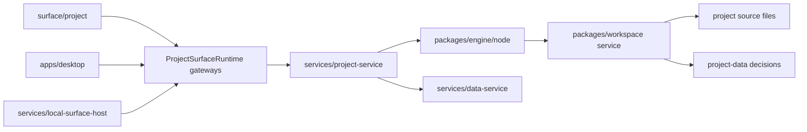
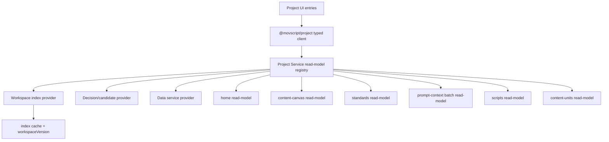

# MovScript 项目服务性能热点审计与优先级

日期：2026-06-29

## 目标

这份文档是 `system-product-maturity-priority-audit.zh-CN.md` 的性能专项补充，聚焦 Project Home 同类问题：打开项目工作区时，页面为了展示手记、制作、设定、画布、提示词、脚本、候选等信息，会不会重复读取项目源文件、重复派生 workspace index、重复传输大对象。

本轮结论基于当前仓库静态阅读和已有 Project Home 优化改动。目标不是只让某个页面“看起来快”，而是把 Project Service 推成稳定的项目级 read-model 服务：接口有边界，读取可预算，写入能失效缓存，性能可观测、可回归。

## 当前机制

当前已经在正确方向上开始收敛：

- Project Home 已新增 `/v1/project/home/read-model`，用一个轻量 read-model 取代页面多次拼底层资源。
- Project Standards 已新增 `/v1/project/standards/read-model`，设定页已从 6 个 `resourceView` 收敛为 1 个页面 read-model。
- Content Canvas 已新增 `/v1/project/content-canvas/read-model`，画布首屏 loader 会优先走页面 read-model，旧多 query 路径保留为兼容 fallback。
- Scripts 已新增 `/v1/project/scripts/read-model`，手记列表不再通过 `resourceView(kind: 'scripts')` 首屏读取每篇正文；选中脚本后才走 `scripts/source/read` 懒加载 source。
- Agent 输出面板已新增 `/v1/project/content-units/read-model`，只按当前会话投影出的 `contentUnitIds` 读取相关创作片段和候选摘要，不再为了会话产出面板拉 full content workspace。
- Prompt Context 已支持 `contentUnitIds/include/promptText`，Project Service 会在同一次 batch 内共享 engine/index；Content Canvas gateway 已加入短 TTL compiled prompt cache，覆盖 preview/preflight/generate 连续操作。
- Project Service 已给 read-model/source/resource/prompt 路径加入结构日志，包含 `requestId`、endpoint、routeKind、status、durationMs、responseBytes，并在关键路径记录 `indexLoadMs`、`deriveMs`、`decisionMs`、`cacheHit`。
- `benchmark:project-service` 已支持 fixture 模式，可自启当前 Project Service、生成临时项目，并输出 Home/Standards/Scripts/Content Units/Content Canvas/Prompt Context 等 endpoint 的客户端耗时和 server phase metrics。
- Project Service 当前工作区已引入 `createProjectWorkspaceEngine` 和 engine registry，避免同一个项目上下文重复创建 engine。
- `packages/workspace` 当前工作区已给 `loadIndex` 增加短 TTL、in-flight 去重和写后失效。
- Editing Service 的 production/timeline assembly bundle 已改为一次 `loadIndex()` 后用纯函数派生 production context 和 preview timeline，不再在 bundle 内让各子方法隐式取 index。
- `resourceView` 已标记为 `debug_compat`，响应会返回 `preferredEndpoint`，调试 Surface 也明确显示它不是复杂产品页面首屏接口。

这些改动已经把 Home、Standards、Scripts、Agent content units、Content Canvas 推向页面级 read-model，并把 prompt 编译链、阶段化观测和 benchmark fixture 纳入 Project Service；Editing Service 的 timeline bundle 也完成了显式共享 index；resourceView 则降级成有迁移提示的 debug/compat 接口。后续重点是：继续裁剪大字段，并推进剩余 content workspace 场景的按需读取。

## 主要性能模式

| 模式 | 表现 | 风险 |
| --- | --- | --- |
| UI 自拼多接口 | 页面 `Promise.all` 多个 query/resourceView | 每个子请求都可能派生 index，冷启动时尾延迟叠加 |
| 通用全量快照 | 为了首屏展示调用 content workspace read/snapshot | 返回超出首屏需要的数据，且会读取 timeline/edit plan |
| prompt 单点反复编译 | 预览、preflight、generate 都可能重新构造 backend prompt | 用户编辑 prompt 或切模型时频繁命中项目索引 |
| resourceView 泛化过度 | `kind` 不同但服务端路径各自读 index/query | 页面级数据形状不稳定，难以做缓存和预算 |
| eager body/source | 列表接口顺手带全文、source、候选详情 | 列表首屏随着项目增长线性变慢 |
| 缺少性能口径 | 没有统一 request id、cache hit/miss、endpoint latency | 慢的时候难判断是读盘、derive、decision overlay 还是网络 |

## 热点证据

| 优先级 | 热点 | 当前证据 | 建议方向 |
| --- | --- | --- | --- |
| P0 | Content Canvas 首屏 | 已落地 `/v1/project/content-canvas/read-model`；Surface loader 优先使用 read-model，旧 `Promise.all` 多 query + `loadContentSourceWorkspaceData` 路径只作为 fallback；benchmark 已覆盖响应体量和 derive ms。 | 继续压缩 read-model 大字段；后续把重编辑详情和候选详情拆成按需接口。 |
| P0 | Project Standards/设定页 | 已落地 `/v1/project/standards/read-model`；`ProjectStandardsSurface` 已改用 `standardsReadModel` gateway，不再用 6 个 `resourceView` 拼首屏；benchmark 已覆盖。 | 旧 `resourceView` 保留给调试/通用列表，后续不再作为复杂页面首屏依赖。 |
| P0 | Prompt context/提示词编译 | 已支持 `/v1/project/prompt/context` batch/include/promptText；Desktop/Local bridge 会只请求所需字段；Content Canvas gateway 已用短 TTL cache 复用同一内容单元同 promptText 的 backend prompt。 | 继续补 compiled prompt hash/workspaceVersion 到响应，后续可跨组件复用并做条件请求。 |
| P1 | Content workspace 全量读取 | `loadContentSourceWorkspaceSnapshotFromEngine` 会 `loadIndex()`、`engine.review()`、查询 settings/assets/context、派生 preview timelines，并逐个 scene moment 尝试读 edit plan。Agent 输出面板已改为按 `projection.contentUnitIds` 读取 `/v1/project/content-units/read-model`。 | 继续拆成通用 `content-summary/read-model`、`timeline-status/read-model`、`editing-detail/read`；保留 full content workspace 作为兼容/重详情路径。 |
| P1 | Scripts 页面 | 已落地 `/v1/project/scripts/read-model`；`ProjectScriptsSurface` 首屏改为 scripts read-model，script row 不带 `source/content/raw_source`，选中后再用 `scripts/source/read` 读正文；benchmark 已覆盖。 | 后续可继续把版本正文也拆成按展开懒加载，并给列表补 limit/cursor。 |
| P1 | Editing Service timeline bundle | 已落地：production/timeline assembly bundle 先 `loadIndex()`，再通过 `queryMovScriptWorkspaceProductionContext(index)`、`deriveMovScriptWorkspacePreviewTimelines(index)`、`deriveMovScriptWorkspaceTimelineAssemblyPreviewTimeline(index)` 派生数据；新增架构测试防止回退。 | 后续补 Editing Service endpoint metrics 和 fixture benchmark，把 bundle 耗时纳入 release gate。 |
| P1 | resourceView 泛接口 | 已落地：`resourceView` 保留旧 endpoint/capability，但响应标记 `debug_compat`，并返回 `preferredEndpoint` 指向 Standards/Scripts/Content Units/Content Canvas 等页面 read-model；调试 Surface 同步展示该边界。 | 后续只作为调试/兼容接口维护；新复杂页面必须走页面 read-model 或专用 read endpoint。 |
| P2 | 前端 query 策略 | Content Canvas 主 query 有 12s staleTime；model selector `staleTime: 0`，部分 standards query 没有 staleTime，workspaceArtifacts 1.5s polling。 | 对稳定目录/模型/资源列表设置合理 staleTime；轮询只用于运行中 workspace，并在页面隐藏时停用。 |
| P2 | 大列表渲染 | assets/content units/candidates/scripts 增长后，列表和 inspector 可能全量渲染。 | 分页、虚拟列表、按 selection 展开详情，read-model 只返回 summary rows。 |

## 推荐目标架构

Project Service 应从“底层操作集合”升级为“项目页面 read-model 服务”：

每个 read-model 都应具备同一套产品化约束：

- 输入：`projectDir/projectUid/projectId`、`include`、`limit/cursor`、`workspaceVersion` 可选。
- 输出：`schema`、`generatedAt`、`workspaceVersion`、`cache` 信息、页面需要的裁剪数据。
- 缓存：同项目同 decision scope 共享 index；写入后由 workspace service 失效。
- 观测：记录 `requestId`、endpoint、冷/热读、index load ms、derive ms、decision ms、response bytes。
- 回归：每个 read-model 有 fixture benchmark 和 contract test。

## 分阶段优先级

### P0：先把打开项目的主要页面变稳

1. Content Canvas read-model
   - 已新增 endpoint：`/v1/project/content-canvas/read-model`。
   - 已接入 typed client、Project Service、Desktop preload、Local Surface Host、Content Canvas gateway 和 `loadContentCanvasProject`。
   - 首版包含：project、productions、segments、sceneMoments、storyboards、expressionUnits、contentUnits、keyframes、settings、settingStates、audioCues、assets、candidate summary、domainGraph、editingProjectsByNodeId、assetReferenceUnits、productionWorkPlan。
   - 当前验收：内容画布首屏优先 1 次 read-model 请求；旧多 query 路径仍保留为无 host 能力时的 fallback。
   - 后续收敛：继续拆出重 candidate outputs、editing detail、resource detail，并补 request 级性能指标。

2. Standards read-model
   - 已新增 endpoint：`/v1/project/standards/read-model`。
   - 已替换 `ProjectStandardsSurface` 中 6 个 `resourceView`。
   - 当前验收：设定页首屏一次 Project Service 请求，响应字段只覆盖设定页需要的 project/settings/assets/production context。

3. Prompt context batch/cache
   - 已支持 `/v1/project/prompt/context` 的 `contentUnitIds`、`include` 和 `promptText`。
   - 已让 Desktop/Local bridge 对 `generationPrompt/backendPrompt` 只请求对应字段。
   - 已让画布预览、preflight、generate 共享短 TTL compiled prompt cache，cache key 覆盖 project/contentUnit/promptText/decision scope。
   - 当前验收：同一节点连续预览/预检不会重复触发 bridge prompt 编译；切模型只重做模型 readiness，不重编 prompt。
   - 后续收敛：把 compiled prompt hash 和 workspaceVersion 写入服务端响应，支持更稳定的跨组件缓存。

4. 性能观测最小闭环
   - 已给 Project Service 的 read-model/source/resource/prompt 路径打结构日志。
   - 当前指标包含：`requestId`、endpoint、routeKind、statusCode、durationMs、responseBytes、`indexLoadMs`、`cacheHit`、`deriveMs`、`decisionMs`。
   - 已更新 `benchmark:project-service`，fixture 模式可以自启当前服务并输出 Home、Standards、Content Canvas、Prompt Context、resourceView 等 endpoint 的客户端耗时和 server phase metrics。
   - 验收：用户反馈“打开慢”时，当前能判断慢 endpoint、响应体量，并定位 index/derive/decision 的具体阶段。

### P1：减少全量数据和重复泛接口

1. Scripts read-model 懒加载 source
   - 已新增 endpoint：`/v1/project/scripts/read-model`。
   - 已接入 typed client、Project Service、Desktop Project Surface Runtime、Local Surface Host Runtime 和 `ProjectScriptsSurface`。
   - 列表只返回 metadata、版本摘要、bodyLength/sourcePath/sourceLoaded/currentVersion，不返回 `source/content/raw_source`。
   - 选中脚本后再读 source，旧 `resourceView` 路径保留为缺少 read-model gateway 时的 fallback。
   - 验证：`pnpm --filter @movscript/project test`、`pnpm --filter @movscript/project-service test`、`pnpm --filter @movscript/project-surface typecheck`、`MOVSCRIPT_PROJECT_BENCHMARK_FIXTURE=1 MOVSCRIPT_PROJECT_BENCHMARK_RUNS=1 node scripts/benchmark-project-service-performance.mjs`。

2. Agent 输出面板按需读取 content units
   - 已新增 endpoint：`/v1/project/content-units/read-model`。
   - 已接入 typed client、Project Service、benchmark fixture 和 `AgentSessionOutputPane`。
   - `AgentSessionOutputPane` 会传当前会话 projection 需要的 `contentUnitIds`，只返回相关 content unit、candidate summary 和 selection 状态。
   - mutation/app event invalidation 同时刷新新的 content-units query 和旧 content-workspace query，兼容仍依赖旧 key 的 surface。
   - 验证：`pnpm --filter @movscript/project test`、`pnpm --filter @movscript/project-service test`、`pnpm --filter @movscript/desktop typecheck`、`pnpm --filter @movscript/desktop exec node ../../scripts/run-node-tests.mjs src/features/agent/components/AgentSessionOutputModel.test.ts src/shared/application/appEventQueryInvalidation.test.ts src/shared/application/appMutationEventPublishing.test.ts`、`MOVSCRIPT_PROJECT_BENCHMARK_FIXTURE=1 MOVSCRIPT_PROJECT_BENCHMARK_RUNS=1 node scripts/benchmark-project-service-performance.mjs`。

3. Editing Service 共享 index
   - 已让 production/timeline assembly bundle 先加载一次 index，再从同一个 index 派生 production context、legacy production preview timeline、timeline assembly preview timeline。
   - 已新增架构测试，防止 bundle 路径重新调用 `workspaceService.queryProductionContext()` 或 `workspaceService.readTimelineAssemblyPreviewTimeline()`。
   - 验证：`node --check services/editing-service/src/server.mjs`、`pnpm --filter @movscript/editing-service test`。

4. resourceView 降级为调试/兼容接口
   - 已保留旧 endpoint/capability，避免破坏已有工具。
   - 已在 Project Service 响应中加入 `usage/viewMode: debug_compat` 和 `preferredEndpoint/preferred_endpoint`。
   - 已在 typed client 响应类型和 Project Resource View debug surface 中显示该兼容边界。
   - 验证：`pnpm --filter @movscript/project test`、`pnpm --filter @movscript/project-service test`、`pnpm --filter @movscript/project-surface typecheck`。

### P2：缓存策略和大项目 UI

1. 前端 query policy 统一
   - 模型目录、资源列表、项目 read-model、prompt preview 分别定义 staleTime。
   - 轮询只在有运行中任务/工作区时开启。

2. workspaceVersion/digest
   - read-model 输出 workspaceVersion。
   - 前端 query key 或条件请求使用 workspaceVersion，避免无变化时重复拉全量。

3. 大列表分页和虚拟化
   - content units、assets、candidates、scripts 都按 summary rows 渲染。
   - inspector/detail 再读取大字段。

### P3：长期服务化

1. file watcher + 增量 index
   - 短 TTL 适合当前阶段，但成熟产品需要 watch/digest 驱动的稳定缓存。

2. read-model registry 契约生成
   - 从 `@movscript/project` 输出 endpoint 常量、TS 类型、runtime schema 和 contract fixtures。

3. benchmark 进入 release gate
   - Home、Content Canvas、Standards、Prompt Context、Scripts、Editing Bundle 都有固定 fixture 和阈值。

## 建议性能预算

这些预算先作为产品体验目标，后续通过 benchmark 校准：

| 场景 | 冷启动目标 | 热缓存目标 | 说明 |
| --- | --- | --- | --- |
| Project Home | < 800ms | < 250ms | 已有 home read-model，可先作为基线 |
| Standards | < 900ms | < 300ms | P0 read-model 后应接近 Home |
| Content Canvas 首屏 | < 1500ms | < 500ms | 首屏只显示图结构和摘要，详情懒加载 |
| Prompt preview | < 500ms | < 150ms | 同节点同 promptText 应命中 compiled prompt cache |
| Scripts 列表 | < 600ms | < 200ms | 列表不带全文 source |
| Editing timeline bundle | < 1200ms | < 400ms | 需要 timeline 派生，预算略高 |

## 不建议的修法

- 只把 `loadIndex` TTL 调大。这样会掩盖问题，还可能让写入后一致性变差。
- 只在前端加 skeleton/loading。用户仍然要等全量数据，且慢点不可观测。
- 每个页面各自加本地缓存。这样会让 Desktop、Local Surface、MCP、Project Surface 的行为继续分叉。
- 让 `resourceView` 继续承担复杂页面首屏。它适合兼容和调试，不适合作为产品页面 read-model。

## 下一步拆解

建议按这个顺序开工：

1. P0-1：`standards/read-model` 已落地。验证：`pnpm --filter @movscript/project test`、`pnpm --filter @movscript/project-service test`、`pnpm --filter @movscript/project-surface typecheck`、`pnpm --filter @movscript/desktop typecheck`、`pnpm --filter @movscript/local-surface-host typecheck`。
2. P0-2：`content-canvas/read-model` 已落地。验证：`pnpm --filter @movscript/project test`、`pnpm --filter @movscript/project-service test`、`pnpm --filter @movscript/project-surface test`、`pnpm --filter @movscript/project-surface typecheck`、`pnpm --filter @movscript/desktop typecheck`、`pnpm --filter @movscript/local-surface-host typecheck`、`node ../../scripts/run-node-tests.mjs --test-name-pattern "content canvas project loader prefers the project service read model when available" "src/features/content/application/contentCanvasArchitecture.test.ts"`。
3. P0-3：`prompt/context` batch/include/cache 已落地。验证：`pnpm --filter @movscript/project test`、`pnpm --filter @movscript/project-service test`、`pnpm --filter @movscript/project-surface typecheck`、`node ../../scripts/run-node-tests.mjs --test-name-pattern "content canvas generation reuses compiled prompt context across preview, preflight, and submit" "src/features/content/application/contentCanvasArchitecture.test.ts"`。
4. P0-4：Project Service phase-level 性能日志和 benchmark fixture 已落地。验证：`pnpm --filter @movscript/project-service test`、`MOVSCRIPT_PROJECT_BENCHMARK_FIXTURE=1 MOVSCRIPT_PROJECT_BENCHMARK_RUNS=1 node scripts/benchmark-project-service-performance.mjs`。
5. P1-1：`scripts/read-model` 和 source 懒加载已落地。验证：`pnpm --filter @movscript/project test`、`pnpm --filter @movscript/project-service test`、`pnpm --filter @movscript/project-surface typecheck`、`MOVSCRIPT_PROJECT_BENCHMARK_FIXTURE=1 MOVSCRIPT_PROJECT_BENCHMARK_RUNS=1 node scripts/benchmark-project-service-performance.mjs`。
6. P1-2：Agent 输出按 contentUnitIds 读取已落地。验证：`pnpm --filter @movscript/desktop typecheck`、`pnpm --filter @movscript/desktop exec node ../../scripts/run-node-tests.mjs src/features/agent/components/AgentSessionOutputModel.test.ts src/shared/application/appEventQueryInvalidation.test.ts src/shared/application/appMutationEventPublishing.test.ts`、`MOVSCRIPT_PROJECT_BENCHMARK_FIXTURE=1 MOVSCRIPT_PROJECT_BENCHMARK_RUNS=1 node scripts/benchmark-project-service-performance.mjs`。
7. P1-3：Editing Service 共享 index 已落地。验证：`node --check services/editing-service/src/server.mjs`、`pnpm --filter @movscript/editing-service test`。
8. P1-4：resourceView debug/compat 降级已落地。验证：`pnpm --filter @movscript/project test`、`pnpm --filter @movscript/project-service test`、`pnpm --filter @movscript/project-surface typecheck`。
9. P1-5：继续处理更通用的 `content-summary/timeline-status/editing-detail` 拆分。

完成 P0、P1-1、P1-2、P1-3 和 P1-4 后，用户感知会从“打开项目多个入口都像在重新读整个项目”变成“每个入口拿自己的页面模型，手记正文和会话相关创作片段等细节按需展开；进入剪辑装配时也不会在同一个 bundle 内重复派生基础项目索引；通用 resourceView 不再被误用为复杂页面首屏接口”。
