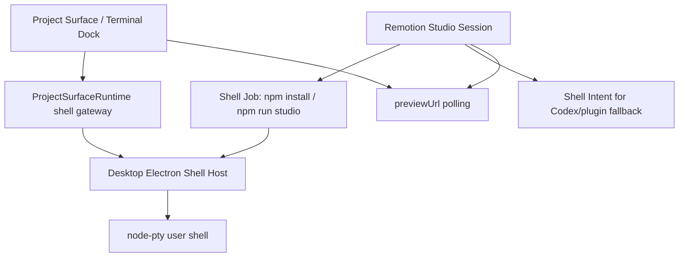

# MovScript Shell 能力整合方案

状态：规划稿  
日期：2026-07-02  
适用范围：Desktop App、Project Surface、local daemon、Agent Plugin/Codex 协作、Remotion Studio workspace、未来需要用户可见命令行的系统任务。

## 1. 背景

Remotion Studio 打开失败暴露了一个更通用的问题：

- Remotion workspace 依赖用户 Node/npm/pnpm 环境。
- Desktop GUI 进程直接 `spawn('npm')` 时，macOS 上常拿不到用户登录 shell 的 `PATH`，容易出现 `spawn npm ENOENT`。
- 当前 MovScript 已有本地 Terminal 能力，但它主要作为 Agent Terminal 面板存在，还没有成为 Project Surface、daemon session、系统任务共用的基础服务。
- Media Pipeline 不应该负责启动 Remotion Studio 这类长时间运行、交互式、开发服务器形态的进程。

因此需要把 “Terminal 面板” 提升为 “Shell Session Service”：既支持用户自己打开 shell，也支持系统为了 Remotion、依赖安装、doctor、脚手架等动作启动可见 shell。

## 2. 目标

1. 统一用户 shell 与系统 shell 的创建、状态、日志、输入、停止、复用、可见性。
2. 让系统启动的命令可以显示在 MovScript shell 中，而不是藏在 daemon spawn 或 media pipeline task 中。
3. 支持 Remotion Studio 这样的长期服务：安装依赖、启动 Studio、轮询 previewUrl、嵌入 WebView/iframe。
4. 参考 VS Code 的 Integrated Terminal 和 Tasks：终端是用户可见的交互面，任务是系统启动的命令，可选择 reveal 到终端。
5. 明确全局、窗口、工作区三个作用域，避免多个项目窗口互相抢 terminal session。

## 3. 当前基线

当前代码已经具备这些基础：

- Electron main 侧有 `localTerminalManager`：`apps/desktop/electron/services/localTerminal.ts`
  - 使用 `node-pty` 创建真实 PTY。
  - 通过 `terminal:create/write/resize/kill` IPC 暴露给 renderer。
  - 使用 `localTerminalEnv` 注入 MovScript CLI、Data Service URL、workspace/project 环境变量。
- Renderer 侧有 Agent Terminal 控制器：`apps/desktop/src/features/agent/components/useAgentTerminalController.ts`
  - 管理多个 shell tab。
  - 使用 xterm 渲染输出。
  - 当前状态在 renderer 模块内存中，遇到 workspaceContext 变化会 reset。
- App Shell 有 Terminal Dock：`apps/desktop/src/features/app-shell/application/AppShellTerminalDock.tsx`
  - 可以嵌在项目页面、工具页面等 App Shell 布局中。
- local daemon 目前有 Remotion Studio session endpoints：
  - `/v1/remotion-studio/sessions/open`
  - `/v1/remotion-studio/sessions/get`
  - `/v1/remotion-studio/sessions/logs`
  - `/v1/remotion-studio/sessions/stop`
  - 但当前实现仍直接 `spawn(command[0], ...)`，这就是 `spawn npm ENOENT` 的来源。

缺口：

- Terminal 能力还不是稳定的服务合同。
- 用户 shell 与系统 shell 没有统一数据模型。
- session id 目前类似 `shell_1`，如果多个窗口同时存在，main process 的 session map 可能发生命名冲突。
- 系统任务无法复用 Terminal Dock，也无法把“安装依赖”变成可见、可恢复、可停止的 shell job。
- Agent Plugin / Local Surface Host 运行在 Codex 或浏览器环境时没有 Desktop Terminal；这类场景不应让 daemon 再实现一套 shell host，而应返回可执行 Shell Intent，由 Codex shell 或用户外部终端执行。

## 4. 设计原则

### 4.1 Shell 是用户环境入口

凡是依赖用户本机工具链、登录 shell、Node version manager、交互确认、长时间开发服务的动作，优先走 Shell Session Service。

适合 shell：

- `npm install`
- `pnpm install`
- `npm run studio -- --port 60550 --no-open`
- `npx remotion studio ...`
- `movscript runtime doctor`
- 需要用户看到输出并可能手动输入的命令

不适合 shell：

- 纯后台、可重试、可结构化追踪的 render/transcode/HLS/reframe，继续归 Media Pipeline。
- Project Service 的业务读写，不通过 shell。
- Data Service 的 API 操作，不通过 shell。

### 4.2 Task 和 Terminal 分离

参考 VS Code：

- Terminal 是交互式 PTY 实例。
- Task 是系统启动的命令声明和生命周期。
- Task 可以 reveal 到 Terminal，也可以复用已有 Terminal。
- 用户可以看输出、停止、重跑，但系统仍能读取结构化状态。

MovScript 对应：

- Shell Session：PTY 进程和 IO。
- Shell Job：系统启动的命令，绑定到一个 Shell Session。
- Feature Session：业务层 session，例如 Remotion Studio session，引用 Shell Job 和 previewUrl。

### 4.3 作用域默认按窗口隔离，系统 job 按工作区复用

不要简单做“全部全局”，也不要简单做“每个页面一个”。推荐三层作用域：

| 作用域 | 用途 | 生命周期 | 默认可见性 |
| --- | --- | --- | --- |
| `window` | 用户手动打开的 Terminal shell | 当前 Desktop window | 当前窗口 Terminal Dock |
| `workspace` | 系统启动的工作区任务，例如 Remotion Studio、依赖安装 | 工作区或项目窗口存活期间，可跨页面恢复 | 相关项目窗口可见 |
| `home` | 全局诊断、runtime doctor、安装修复 | MovScript Home | 全局 Runtime/Settings 页面可见 |

推荐默认：

- 用户点击 “新增 shell”：`scope = window`，绑定当前 `windowId + workspaceKey`。
- 系统点击 “安装依赖” 或 “启动 Remotion Studio”：`scope = workspace`，绑定 `projectUid/projectDir/workspaceId`。
- runtime doctor 或 plugin repair：`scope = home`。

这样可以避免两个项目窗口都叫 `shell_1` 的冲突，同时系统 job 可以在用户切换页面后继续显示。

## 5. 核心概念

### 5.1 Shell Host

真正创建 PTY 的宿主。

推荐决策：MovScript 内置 Shell Host 只做 Desktop。

Desktop Electron Shell Host：

- 用户使用 Desktop 时的唯一 MovScript-managed shell owner。
- 能显示 Terminal Dock。
- 能用 `node-pty` 创建交互式 PTY。
- 能把系统任务 reveal 给用户。

Agent Plugin / Codex 场景：

- MovScript 不再实现 daemon Shell Host。
- 插件返回 Shell Intent，例如 `cwd + command + reason`。
- Codex 本身有 shell 执行能力，可按 intent 执行命令、展示输出、处理权限确认。
- 如果用户不想由 Codex 执行，也可以复制 intent 到外部终端。

未来远程工作区或 cloud runtime 如需 shell，应作为独立 Remote Shell Provider 设计，不放进 local daemon 的默认职责里。

### 5.2 Shell Session

一个 PTY 实例。

建议字段：

```ts
type ShellSession = {
  schema: 'movscript.shell_session.v1'
  sessionId: string
  owner: 'user' | 'system'
  scope: 'window' | 'workspace' | 'home'
  windowId?: string
  workspaceKey?: string
  projectDir?: string
  projectUid?: string
  cwd: string
  shell: string
  status: 'idle' | 'starting' | 'running' | 'exited' | 'failed'
  title: string
  createdAt: string
  updatedAt: string
  pid?: number
}
```

### 5.3 Shell Job

系统启动的一次命令运行。

```ts
type ShellJob = {
  schema: 'movscript.shell_job.v1'
  jobId: string
  sessionId: string
  ownerFeature: 'remotion_studio' | 'runtime_doctor' | 'project_scaffold' | string
  command: string[]
  commandText: string
  cwd: string
  status: 'queued' | 'running' | 'succeeded' | 'failed' | 'stopped'
  reveal: 'always' | 'on_error' | 'silent'
  startedAt?: string
  endedAt?: string
  exitCode?: number
}
```

### 5.4 Feature Session

业务层 session 引用 shell job，而不是自己 spawn。

Remotion Studio session 示例：

```ts
type RemotionStudioSession = {
  schema: 'movscript.remotion_studio_session.v1'
  sessionId: string
  workspaceId: string
  projectDirectory: string
  status: 'checking' | 'installing' | 'starting' | 'ready' | 'blocked' | 'failed' | 'stopped'
  shellJobId?: string
  shellSessionId?: string
  installJobId?: string
  previewUrl?: string
  port?: number
  blockers?: Array<{ code: string; message: string; installCommand?: string[] }>
}
```

## 6. 建议架构



### 6.1 Electron main：从 `localTerminalManager` 升级为 Shell Host

当前 `localTerminalManager` 可以保留，但需要扩展：

- session id 由 renderer 随便传入，改成 main process 分配或校验 namespace。
- 增加 `owner/scope/windowId/workspaceKey/projectDir/projectUid/title`。
- 增加 `createJob` 或 `runCommand`。
- 增加 shell output ring buffer，允许页面后打开也能读到历史日志。
- 事件不要无差别广播给所有窗口，应按 `windowId/scope/workspaceKey` 过滤。

建议 IPC：

```ts
terminal:createSession(input)
terminal:runCommand(input)
terminal:write(input)
terminal:resize(input)
terminal:kill(input)
terminal:listSessions(input)
terminal:getSession(input)
terminal:getLogs(input)
terminal:onEvent(handler)
```

### 6.2 Renderer：Terminal Dock 成为通用 Shell 面板

现在 `AgentTerminalPanel` 命名偏 Agent。建议逐步拆出：

- `ShellPanel`
- `ShellSessionList`
- `ShellTerminalViewport`
- `useShellController`

Agent Terminal 只是 ShellPanel 的一种挂载位置。

Project Surface、Remotion Studio 页面、Runtime Settings 都可以打开同一个 ShellPanel：

- 用户手动 shell：显示在 Terminal Dock。
- 系统 job：在 Remotion 页面显示 “Shell” panel，同时可以一键 “在 Terminal 打开”。
- 出错时自动 reveal Terminal。

### 6.3 ProjectSurfaceRuntime：新增 shell gateway

Project Surface 不应直接知道 Electron IPC 或 daemon 细节。runtime 增加：

```ts
interface ShellGateway {
  list(input: ShellListInput): Promise<unknown>
  create(input: ShellCreateInput): Promise<unknown>
  run(input: ShellRunInput): Promise<unknown>
  get(input: ShellGetInput): Promise<unknown>
  logs(input: ShellLogsInput): Promise<unknown>
  write(input: ShellWriteInput): Promise<unknown>
  stop(input: ShellStopInput): Promise<unknown>
  reveal?(input: ShellRevealInput): Promise<unknown>
}
```

Desktop runtime 实现：

- 优先走 Electron `window.movscript.createLocalTerminal/runCommand`。
- reveal 时打开 Terminal Dock 并选中 session。

Agent Plugin / Local Surface Host 实现：

- 不实现交互式 Shell Gateway。
- 只消费业务接口返回的 Shell Intent。
- Codex agent 可以使用自己的 shell 工具执行 intent。
- 如果没有 Codex shell，则 UI 显示命令和 cwd，让用户复制到外部终端。

### 6.4 Local daemon：返回 Shell Intent，而不是实现 Shell Host

daemon 不应为了插件/full-local 再维护一套 PTY/session/web-terminal。它只负责业务 session 编排和 capability 声明：

- Desktop 可用时：Project Surface runtime 通过 Electron Shell Host 执行 Shell Job。
- Desktop 不可用时：daemon/API 返回 Shell Intent。
- Plugin/Codex 可读取 Shell Intent，用 Codex shell 执行。
- Local Surface Host 可展示 Shell Intent，但不承诺内嵌交互 shell。

Shell Intent 示例：

```ts
type ShellIntent = {
  schema: 'movscript.shell_intent.v1'
  intentId: string
  reason: string
  cwd: string
  command: string[]
  commandText: string
  ownerFeature: 'remotion_studio' | 'runtime_doctor' | string
  destructive: boolean
}
```

这避免了 daemon 既做 runtime owner 又做用户 shell owner 的职责膨胀。

## 7. Remotion Studio 整合流程

### 7.1 打开 Remotion workspace

1. Project Service 返回：

```json
{
  "open_action": {
    "kind": "remotion_studio_session",
    "workspaceId": "...",
    "projectDirectory": ".../remotion",
    "entrypoint": "src/Root.tsx",
    "command": ["npm", "run", "studio", "--"]
  }
}
```

2. Project Surface runtime 调用 `remotionStudio.open`。
3. Remotion Studio session service 检查：
   - `package.json`
   - `src/Root.tsx`
   - `node_modules/remotion` 或 `.bin/remotion`
4. 如果缺依赖：
   - status = `blocked`
   - blocker = `REMOTION_DEPENDENCIES_MISSING`
   - 提供 `installCommand` / `ShellIntent`
   - Desktop UI 显示 “安装依赖” 按钮。
   - Plugin/Codex 场景返回 Shell Intent，提示 agent 或用户执行。

### 7.2 安装依赖

Desktop 中点击 “安装依赖”：

1. 创建 workspace-scoped Shell Job：

```json
{
  "ownerFeature": "remotion_studio",
  "cwd": ".../remotion",
  "command": ["npm", "install"],
  "reveal": "always"
}
```

2. Terminal Dock 打开并显示安装输出。
3. Job 成功后，Remotion session 自动重新检查依赖。
4. 如果成功，进入启动 Studio。

Plugin/Codex 中：

1. `remotionStudio.open` 返回 `REMOTION_DEPENDENCIES_MISSING` 和 Shell Intent。
2. Codex 使用自己的 shell 执行 `cd <cwd> && npm install`。
3. 执行完成后重新调用打开或检查接口。

### 7.3 启动 Studio

Desktop 中，启动命令也走 Shell Job：

```bash
npm run studio -- --port 60550 --no-open
```

Desktop session controller 只负责：

- 分配端口。
- 创建 Shell Job。
- 轮询 `http://127.0.0.1:<port>`。
- ready 后把 `previewUrl` 返回给 Project Surface。
- stop 时停止 Shell Job。

Desktop 中这样可以避免 `spawn npm ENOENT`，因为命令由用户 shell 环境解析。
Plugin/Codex 中则不启动 Desktop Shell Job，而是返回/消费 Shell Intent：

- Codex agent 可用自己的 shell 启动 Studio。
- 用户也可以复制命令到外部终端启动。
- `previewUrl` 可以由调用方在成功启动后写回或重新检查获得。

## 8. 用户体验

### 8.1 用户手动 shell

入口：

- App Shell Terminal Dock。
- Agent 页面 Terminal。
- Project 页面 Terminal。

默认行为：

- 新 shell 绑定当前窗口和当前 workspace。
- `cwd` 是当前 project/workspace cwd。
- tab 标题为 `Shell 1`，用户可重命名。
- 关闭窗口时，window-scoped shell 默认结束。

### 8.2 系统启动 shell

入口：

- Remotion Studio blocked 页面：安装依赖。
- Remotion Studio starting 页面：启动/重启 Studio。
- Runtime doctor 页面：运行 doctor。

默认行为：

- 系统 shell 绑定 workspace 或 home。
- Terminal Dock 自动打开，或在错误时 reveal。
- Shell tab 标题使用业务名，例如 `Remotion install`、`Remotion Studio`。
- 用户可以停止、复制命令、重新运行。
- 系统可以读取 exit code 和日志。

### 8.3 页面内嵌日志与 Terminal 的关系

Remotion Studio 页面可以显示简化 shell logs，但完整交互仍在 Terminal Dock。

建议：

- 页面右侧 Shell panel 显示只读摘要。
- “在 Terminal 打开” 选中对应 shell session。
- 如果 command 需要用户输入，自动 reveal Terminal。

## 9. 安全和权限

Shell 是高权限能力，需要明确区分：

- 用户手动 shell：用户主动打开，默认允许输入。
- 系统 shell：必须展示将要执行的命令、cwd、来源 feature。
- 对破坏性命令需要确认，例如删除、覆盖、安装全局包。
- 系统不能在用户 shell 中偷偷输入命令，应创建 system-owned session 或要求用户确认。
- 日志可能包含 token/path，跨窗口显示时按 workspace/home scope 过滤。

建议 confirmation 规则：

| 命令类型 | 是否自动执行 | 说明 |
| --- | --- | --- |
| `npm install` in generated Remotion workspace | 可以一键确认后执行 | cwd 是 MovScript 创建的 workspace |
| `npm run studio -- --no-open` | 可以直接执行 | 非破坏性长服务 |
| `rm -rf`、覆盖用户文件 | 必须确认 | 高风险 |
| 全局安装 `npm install -g` | 必须确认 | 改变用户全局环境 |

## 10. 实施路径

### Phase 1：抽象合同，不大动 UI

- 在 shared contracts 中定义 Shell Session / Shell Job 类型。
- Electron `localTerminalManager` 增加 `runCommand`。
- create input 增加 `owner/scope/windowId/workspaceKey/title/cwd/initialCommand`。
- 保留现有 Agent Terminal UI，先通过扩展参数支持系统 shell tab。

### Phase 2：Desktop runtime shell gateway

- `ProjectSurfaceRuntime` 增加 `shell` gateway。
- Desktop runtime 使用 Electron API 实现。
- Terminal Dock 支持 reveal 指定 session。
- Remotion Studio 页面增加：
  - 安装依赖按钮。
  - 重新启动 Studio 按钮。
  - 在 Terminal 打开按钮。

### Phase 3：Remotion Studio 改用 Shell Job

- Remotion Studio session 不再在 local daemon 内直接 `spawn npm`。
- Desktop Remotion controller 调用 runtime shell gateway 创建 Shell Job。
- previewUrl polling 保留在 Desktop session controller。
- blocked -> install -> start -> ready 做成 Desktop 状态机。

### Phase 4：Shell Intent fallback

- 为 Remotion Studio、runtime doctor 等系统动作补 Shell Intent 返回。
- Agent Plugin/Codex 路径识别 Shell Intent，并把命令交给 Codex shell 或展示给用户。
- Local Surface Host 不承诺内嵌交互 shell，只展示 intent、状态和下一步。

### Phase 5：命名、持久化和恢复

- shell sessions 写入 runtime memory + 可选 Home state。
- window reload 后可恢复 workspace-scoped system shell。
- app quit 时：
  - window-scoped user shell 默认停止。
  - workspace-scoped system shell 可询问是否停止。
  - 未消费的 Shell Intent 不保活进程，只保留下一步操作。

## 11. 关键决策

1. Shell 能力应是 runtime 基础能力，不是 Remotion 专用逻辑。
2. 用户手动 shell 默认 window-scoped。
3. 系统启动 shell 默认 workspace-scoped 或 home-scoped。
4. Desktop 存在时，PTY owner 优先是 Electron main process。
5. MovScript-managed Shell Host 只做 Desktop；local daemon 不做 fallback shell host。
6. Agent Plugin/Codex 场景通过 Shell Intent 交给 Codex shell 或用户外部终端。
7. Remotion Studio 不应由 Media Pipeline 启动。
8. Remotion Studio session 在 Desktop 中编排 Shell Job，在插件场景返回 Shell Intent，并继续负责 previewUrl 和嵌入 UI。
9. 页面内日志是摘要，完整交互在 Terminal Dock 或 Codex shell。

## 12. 待确认问题

- Desktop 多窗口是否需要显式 `windowId` 从 Electron main 注入 renderer。
- system shell 在 app quit 时默认停止还是询问用户。
- workspace-scoped shell 是否需要跨 Desktop 重启恢复，还是只保证窗口切换/页面 reload 恢复。
- Shell Intent 由 Codex 自动执行前是否需要 MovScript 给出风险分级。
- Remotion dependency install 是否允许自动执行，还是必须用户点击确认。
