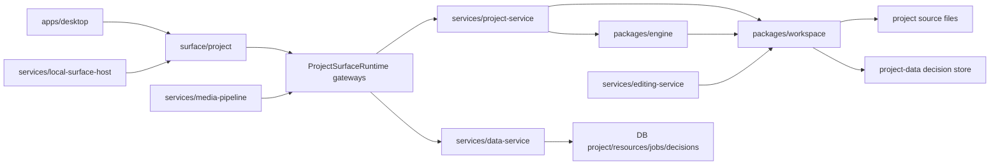

# MovScript 系统产品化成熟度审计与优先级

日期：2026-06-29

## 目标

这份文档面向“把 MovScript 推向成熟产品”的系统化改造。审计重点不是单点功能，而是接口、读取、写入、缓存、一致性、权限、可观测性、测试和发布护栏是否已经具备产品级稳定性。

本轮基于当前仓库静态阅读和关键验证命令形成结论。工作区存在大量未提交改动，本文只记录系统状态与建议，不尝试覆盖用户已有变更。

## 当前系统地图

核心事实：

- `services/project-service` 已经是 project/source/read-model 的主要入口，暴露 typed endpoints 和 `source/command` 万能命令。
- `packages/workspace` 是本地项目源文件读取、索引和写入的核心层。
- `services/data-service` 是云/后端状态、项目记录、资源、任务、project-data decisions 的核心服务。
- `surface/project` 和 `apps/desktop` 仍有一部分直接 fetch/host API 调用，需要继续收敛到 runtime gateway 和 typed client。
- 本轮已经为 Project Home 增加轻量 `/v1/project/home/read-model`，并给 workspace index 增加短 TTL cache 和写后失效。

## 验证记录

已通过：

- `pnpm run check:workspace-packages`
- `pnpm run check:generated-paths`
- `pnpm run runtime:registry`
- `pnpm --filter @movscript/workspace typecheck`
- `pnpm --filter @movscript/project-surface typecheck`
- `pnpm --filter @movscript/project-service test`

当前失败：

- `pnpm --filter @movscript/data-service run test:architecture`
- 失败原因：`TestCommunityCodeDoesNotUseStaleCommercialBoundaryNames` 检测到 `edition`、`enterprise`、`commercial` 等旧商业边界命名仍存在于 community 代码路径和 admin surface 文案/测试中。

## 总体判断

MovScript 的底座不是“原型状态”：仓库分层、服务包、运行时 manifest、Go Data Service 的领域/应用/接口分层、Project Service 的 typed endpoints、workspace 原子写文件能力都已经成型。

下一阶段的成熟化重点是“收敛和硬化”：

- 收敛接口入口，减少 direct fetch、重复 endpoint 常量和万能 command。
- 把读取模型产品化，避免 UI 页面对全量 workspace 做重复扫描。
- 把写入路径产品化，统一乐观锁、多文件事务和写入审计。
- 明确本地服务与云服务的信任边界，补齐权限、CORS、token、request id。
- 让所有质量护栏进入同一条 release gate，并保持常绿。

## 优先级总览

| 优先级 | 主题 | 结论 | 目标 |
| --- | --- | --- | --- |
| P0 | Release gate 变绿 | Data Service architecture gate 当前失败 | 任何产品发布前必须修复或重定义该护栏 |
| P0 | Project-data 权限边界 | scope 级 project-data API 与 project/:id 级角色 API 并存 | 明确 local-only 与 multi-user cloud 边界，防止按 project_uid 绕过项目角色 |
| P0 | 本地服务访问边界 | Project/Editing/Media/Canvas 服务偏 local daemon 假设，CORS 较宽 | 增加 local token/origin allowlist/loopback-only 防线 |
| P0 | 写入并发一致性 | fileRepository 支持 expectedVersion，但多数领域写入口未贯通 | 统一 expectedWorkspaceVersions，冲突返回 409，并在 UI 可恢复 |
| P1 | 接口契约收敛 | endpoint 常量和 fetch 分散在 desktop/local-surface/surface | 以 `@movscript/project` 和 Data client 为唯一契约源 |
| P1 | 读取模型体系化 | 多个 resource/read endpoints 仍会派生全量 index | 建立 read-model registry、分页、裁剪、缓存策略 |
| P1 | Workspace index 服务化 | 当前是递归读盘 + 内存短 TTL | 加 file watcher、version digest、跨请求/跨实例一致缓存 |
| P1 | 多文件写事务 | script、standards、initialize 等是多文件顺序写 | 增加 staged write/journal/rollback 或 commit bundle |
| P1 | 可观测性 | Data Service 较完整，Node local services 较弱 | 统一 request id、结构日志、指标、cache hit/miss、端到端 latency |
| P2 | API runtime schema | TS 类型与 Node 手写校验并存 | 引入运行时 schema/OpenAPI/contract tests |
| P2 | source/command 去万能化 | 万能命令保留了绕过 typed endpoint 的空间 | 标注 deprecated，迁移 MCP/UI 到 typed endpoints |
| P2 | 性能基准 | 已有 benchmark script，但未成为门禁 | 固化 Home/read-model/candidate-view 基线和回归阈值 |
| P3 | SDK 与插件生态 | 插件 skills 与 runtime 能力已有雏形 | 补产品文档、外部 SDK、示例和兼容矩阵 |

## P0 详细任务

### P0-1 修复 release gate：Data Service architecture test

证据：

- `services/data-service/internal/app/architecture_test.go`
- 命令 `pnpm --filter @movscript/data-service run test:architecture` 当前失败。

问题：

- architecture test 明确禁止 community 代码路径出现旧商业边界命名。
- 当前代码中大量 `edition`、`enterprise`、`commercial` 仍被检测到。
- 这会导致 `check:backend` 无法作为稳定发布门禁。

建议：

- 确认产品命名策略：如果仍需要 edition/enterprise 语义，应更新测试规则和架构命名；如果不需要，应重命名代码、配置、文案、测试。
- 把 `check:backend` 纳入主 CI/release gate，不能只靠前端和 package 测试。
- 为该 architecture test 加一份允许列表机制，只允许明确保留的外部协议词，例如 GitHub Enterprise provider。

验收：

- `pnpm --filter @movscript/data-service run test:architecture` 通过。
- `pnpm run check:backend` 通过。
- 新命名规范写入 `docs/` 或 architecture test 注释。

### P0-2 收紧 project-data 权限模型

证据：

- `services/data-service/internal/interfaces/http/router/project_routes.go`
- scope 级接口：`/api/v1/project-data/...`
- project 级接口：`/api/v1/projects/:id/decisions/...`
- scope 校验在 `services/data-service/internal/interfaces/http/handler/project_data.go`

问题：

- scope 级 project-data API 只校验当前 user/org scope，不经过 `RequireProjectRole`。
- 对本地项目和 Desktop owner scope 这是方便的；对多人云产品，它可能让同一 org 下的成员按 `project_uid` 访问不属于自己的项目数据。
- Project Service 又可以通过 `decisionStore` 指向 scoped project-data，因此必须明确这个入口是否 local-only。

建议：

- 定义两个明确模式：
  - Local/Desktop：允许 user scope project-data，但必须经 local daemon token。
  - Cloud/Multi-user：project-data 写入必须绑定 project membership 或走 `/projects/:id/decisions/...`。
- 在 `ProjectDataSpace` 增加可选 `ProjectID` 绑定，或者在 project_uid resolve 后校验项目成员角色。
- Project Service 接收 `decisionStore` 时校验 service trust boundary，避免任意浏览器请求传入任意 baseUrl/scope。

验收：

- org 内非项目成员无法读取/写入该项目 `project_uid` 的 decisions。
- Desktop local-owner 场景仍可离线工作。
- Project Service candidate tests 覆盖 user/org/project-role 三种路径。

### P0-3 本地服务安全边界

证据：

- `services/project-service/src/server.mjs` CORS `access-control-allow-origin: *`
- `services/editing-service/src/server.mjs`
- `services/media-pipeline/src/server.mjs`
- `services/canvas-service/src/server.mjs`

问题：

- 本地服务默认假设运行在 loopback，但 CORS 较宽，且 Project Service 能读写本地 projectDir。
- 如果恶意网页能访问本地端口，可能触发本地文件读取或写入。

建议：

- 所有 local daemon service 增加本地 session token，Desktop/Local Surface 注入 token header。
- CORS 改为 origin allowlist，至少限制到 Desktop/Local Surface origin。
- 对 projectDir 做 workspace allowlist：只允许当前 session 注册过的 projectDir。
- 为 destructive writes 增加 capability 或 user-confirmed session。

验收：

- 无 token 请求 Project Service 写接口返回 401/403。
- 非 allowlisted origin 的浏览器请求被拒绝。
- Project Service tests 覆盖 CORS/token/projectDir allowlist。

### P0-4 统一写入乐观锁

证据：

- `packages/workspace/src/node/fileRepository.ts` 已支持 `expectedVersion`。
- `services/project-service/src/server.mjs` 已将 file version conflict 映射为 409。
- `expectedWorkspaceVersions` 在 `projectSourceOperationInput` 中被剥离，但大多数 workspace repository 写入没有使用。

问题：

- UI 可以拿到文件 version，但领域写入大多不传 expectedVersion。
- 多个窗口/agent 同时编辑时，可能 silent overwrite。
- 当前只有 content canvas 等少数路径显式使用 expectedVersion。

建议：

- 统一 mutation envelope：`expectedWorkspaceVersions: Record<path, version|null>`。
- 所有 workspace write repository 接收并传递 expectedVersion。
- Project Service 对 409 返回标准错误：`code`, `path`, `expected`, `actual`, `recoverable: true`。
- Surface/Desktop 提供冲突恢复 UI：刷新、对比、另存、强制覆盖。

验收：

- 手记、设定、素材、content unit、candidate inline、standards、production snapshot 都覆盖 expectedVersion。
- 并发写测试能稳定得到 409，而不是覆盖。
- UI mutation 对 409 有明确提示和恢复动作。

## P1 详细任务

### P1-1 接口契约单一来源

问题：

- `packages/project/src/index.ts` 已经定义 Project Service endpoint 常量和 client。
- 但 Desktop、Local Surface、Surface 内仍有重复 endpoint 字符串和 direct fetch。

建议：

- 所有 Project Service 调用统一走 `ProjectServiceClient` 或 `ProjectSurfaceRuntime.gateways.project`。
- Local Surface 不再复制 `LOCAL_PROJECT_*_ENDPOINT`，改用 `@movscript/project` 常量。
- Data Service 前端调用也收敛到 `@movscript/data-client` 或 shared client。

验收：

- 搜索 `/v1/project/` 的字符串，除 contract package、tests、server router 外不再散落。
- contract tests 验证 client endpoint 与 server export 一致。

### P1-2 读取模型体系化

现状：

- Project Home 已新增轻量 read model。
- `resources/view`、`read-model`、`source/overview` 等仍各自组织数据。

建议：

- 建立 Project Read Model Registry：
  - `home`: 导航与首页轻量聚合。
  - `overview`: 项目级状态摘要。
  - `content-canvas`: canvas 所需局部图。
  - `production`: 制作链路局部模型。
  - `generation`: content unit + prompt + candidates 局部模型。
- 每个 read model 明确字段预算、是否带正文、是否带 decisions、是否分页。
- UI 页面禁止直接组合多个底层 query，除非已有明确性能预算。

验收：

- Project Home、Content Canvas、Standards、Scripts 页面均有单一 read model 或清晰分页 query。
- benchmark 输出纳入 CI 或 nightly。

### P1-3 Workspace index 服务化

现状：

- `loadIndex()` 递归读 workspace source file，解析后 derive index。
- 本轮已加入短 TTL cache 和 in-flight 去重，但这是进程内优化。

问题：

- 外部编辑、git checkout、另一个 daemon/process 写入时，cache 只能靠 TTL 过期。
- 大项目上仍会周期性全量扫描。

建议：

- Node workspace repository 增加 `workspaceVersionDigest`：文件路径、mtime、size 的摘要。
- Project Service 按 projectDir 维护 index cache + fs watcher。
- 支持局部 invalidation：script/settings/assets/content_units/productions。
- Home/read-model 响应带 `workspaceVersion`，前端 query key 或 stale policy 使用它。

验收：

- 大项目重复打开 Home/read-model 不触发全量递归读。
- 外部文件变化在 1 秒内 invalidated。
- benchmark 中 warm p50 明确下降并有回归阈值。

### P1-4 多文件写事务

现状：

- `upsertScript` 写 `script.md` 再写 `script.json`。
- `initializeProject` 写多个 root 文件。
- `upsertProjectStandards` 写 standards 后同步 standard skill files。

问题：

- 任意一步失败可能留下半写状态。
- 目前没有统一 commit bundle、rollback 或 recovery marker。

建议：

- 增加 `WorkspaceWriteBatch`：
  - validate 阶段：检查路径、expectedVersion、schema。
  - stage 阶段：写临时文件。
  - commit 阶段：atomic rename。
  - recovery 阶段：发现 `.movscript/transactions/*` 可回滚或继续。
- Project Service 写 endpoint 返回 `writeSet`，便于 UI invalidation 和审计。

验收：

- 多文件写失败测试不会留下损坏项目。
- 所有写接口返回受影响路径列表和新 versions。

### P1-5 标准错误与可观测性

问题：

- Data Service 已有 request id、metrics、request logger。
- Project/Editing/Media/Canvas services 的错误和日志格式不统一。
- DecisionStore 内有 `console.info`，测试输出会暴露内部日志，且缺少 request id。

建议：

- 定义统一错误 envelope：
  - `error`
  - `message`
  - `details`
  - `requestId`
  - `retryable`
  - `recoverable`
- Node services 统一 request logger、latency metric、status code metric。
- Project Service 加 cache metrics：index hit/miss、derive duration、document count、decision overlay duration。

验收：

- 前端 toast 能基于 `recoverable/retryable` 展示正确动作。
- Project Home 性能可在日志/metrics 中定位到读盘、derive、decision overlay 或 network。

## P2 任务

### P2-1 Runtime schema 与 OpenAPI/contract

现状：

- TypeScript contract 多，但 Node 服务运行时校验仍以手写 helper 为主。
- Go Data Service 使用 Gin binding，但前端不是完全由 schema 生成。

建议：

- 为 Project Service endpoints 定义 JSON Schema 或 Zod schema。
- 生成 client 类型和 test fixtures。
- Data Service 导出 OpenAPI 或 compact contract，前端 data-client 从契约生成。

### P2-2 Deprecate `source/command`

现状：

- `source/command` 对外暴露多个 command，方便但不利于权限、审计、schema、缓存。

建议：

- 标注 experimental/deprecated。
- MCP 和 UI 逐步迁移到 typed endpoints。
- 万能 command 只保留 dev/debug，并要求 local token。

### P2-3 性能基线产品化

现状：

- `scripts/benchmark-project-service-performance.mjs` 已存在。

建议：

- 增加 Home read-model benchmark。
- 记录 cold/warm p50/p95、响应体大小、document count。
- CI nightly 对典型 fixture 项目跑 benchmark，超阈值报警。

## P3 任务

### P3-1 SDK、插件与外部集成文档

建议：

- 为 Project Service、Data Service、Editing Service 提供外部调用指南。
- 明确哪些 API 是 stable、beta、internal。
- 为 plugin skills 和 MCP tools 增加兼容矩阵。

### P3-2 产品运维文档

建议：

- 增加本地 daemon 启动/健康检查/端口冲突/日志定位文档。
- 增加数据备份与 project workspace 恢复文档。
- 增加 release checklist。

## 建议排期

### 第 1 阶段：发布门禁与安全边界

目标：先把产品化风险最高的红灯清掉。

- 修复 Data Service architecture gate。
- 为 local services 加 token/origin/projectDir allowlist。
- 明确 project-data 的 local/cloud 权限模型。
- 让 `check:backend` 进入主 CI。

### 第 2 阶段：写入可靠性

目标：避免多人/多窗口/agent 并发写导致 silent overwrite。

- 统一 expectedWorkspaceVersions。
- 所有 workspace writes 返回 writeSet 和 versions。
- 多文件写引入 batch/stage/rollback。
- UI 增加冲突恢复。

### 第 3 阶段：读取模型和性能

目标：让页面性能可预测、可度量、可回归防护。

- Read model registry。
- Workspace index watcher + digest cache。
- Home/Canvas/Production/Generation benchmark。
- 页面只消费聚合 read model 或分页 query。

### 第 4 阶段：契约、观测和 SDK

目标：把内部工程系统推进到平台产品。

- Project Service runtime schema。
- Data Service OpenAPI/data-client 生成。
- 统一错误 envelope。
- Node services metrics/logs/request id。
- 外部 SDK 和 stable/beta/internal API 分层。

## 下一步建议

最值得立刻做的是 P0-1 和 P0-3：它们分别代表“CI 是否可信”和“本地服务是否具备产品级安全边界”。随后做 P0-4，因为并发写和多窗口编辑一旦进入真实用户场景，问题会很难追踪。

Project Home 性能这条线已经开始走向正确方向：轻量 read-model + workspace index cache。下一步应把这个模式扩展到 Content Canvas、Standards、Scripts 和 Production，而不是让每个页面继续自行拼接底层 query。
